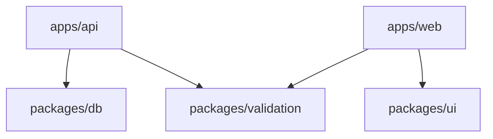

# アーキテクチャ分析テンプレート

## IMPORTANT: このテンプレートに従って一貫した形式でアーキテクチャ分析を行うこと

## 分析手順

### Step 1: プロジェクト構造の把握

```bash
# ディレクトリ構造を確認
ls -la
tree -L 2 -d

# package.json / bun.lockb を確認
cat package.json
```

#### 確認項目

| 項目 | 確認方法 | 記録 |
| ---- | -------- | ---- |
| モノレポ構成 | `turbo.json`, `pnpm-workspace.yaml` | {Yes/No} |
| パッケージマネージャ | lockファイル | {npm/yarn/pnpm/bun} |
| 主要フレームワーク | package.json dependencies | {framework} |
| ビルドツール | scripts, turbo.json | {tool} |

### Step 2: アプリケーション層の分析

```bash
# apps/ 配下を確認
ls -la apps/
```

#### 各アプリの役割

| アプリ | パス | フレームワーク | 役割 |
| ------ | ---- | -------------- | ---- |
| {name} | apps/{name} | {framework} | {役割} |

### Step 3: 共有パッケージの分析

```bash
# packages/ 配下を確認
ls -la packages/
```

#### 各パッケージの役割

| パッケージ | パス | 依存先 | 役割 |
| ---------- | ---- | ------ | ---- |
| {name} | packages/{name} | {apps} | {役割} |

### Step 4: レイヤーアーキテクチャの分析

#### DDD/クリーンアーキテクチャの場合

```text
apps/api/src/
├── domain/           # ドメイン層（エンティティ、値オブジェクト）
├── application/      # アプリケーション層（ユースケース）
├── infrastructure/   # インフラ層（リポジトリ実装、外部サービス）
└── interface/        # インターフェース層（コントローラ、API）
```

| レイヤー | パス | 責務 |
| -------- | ---- | ---- |
| Domain | `src/domain/` | {責務} |
| Application | `src/application/` | {責務} |
| Infrastructure | `src/infrastructure/` | {責務} |
| Interface | `src/interface/` | {責務} |

#### FSD（Feature-Sliced Design）の場合

```text
app/
├── routes/       # ルーティング
├── features/     # 機能単位
├── entities/     # ビジネスエンティティ
├── shared/       # 共通ユーティリティ
└── widgets/      # UIコンポーネント
```

### Step 5: 依存関係の分析

```bash
# 依存関係グラフ
bun run build --graph
```

#### 依存関係図



### Step 6: 設定ファイルの分析

| ファイル | 用途 | 重要設定 |
| -------- | ---- | -------- |
| `tsconfig.json` | TypeScript設定 | paths, strict |
| `biome.json` | Linter/Formatter | rules |
| `vitest.config.ts` | テスト設定 | coverage |
| `turbo.json` | ビルドパイプライン | tasks |
| `.env.example` | 環境変数 | 必要な変数 |

## 出力フォーマット

```markdown
## アーキテクチャ分析結果

### プロジェクト概要

- **種類**: {モノレポ/シングルパッケージ}
- **パッケージマネージャ**: {bun/pnpm/npm}
- **ビルドツール**: {turbo/nx/lerna}

### 構成

| 種類 | 名前 | 技術スタック |
| ---- | ---- | ------------ |
| App | {name} | {stack} |
| Package | {name} | {stack} |

### アーキテクチャパターン

- **バックエンド**: {DDD/クリーンアーキテクチャ/レイヤードアーキテクチャ}
- **フロントエンド**: {FSD/Atomic Design/Container-Presentational}

### 依存関係

{依存関係図}

### 特記事項

- {注意点1}
- {注意点2}
```
