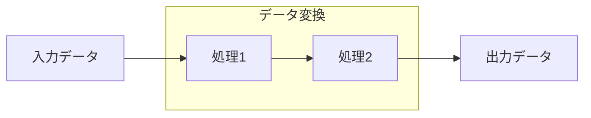

# コード調査テンプレート

## IMPORTANT: このテンプレートに従って一貫した形式でコード調査を行うこと

## 調査手順

### Step 1: 調査目的の明確化

| 項目 | 内容 |
| ---- | ---- |
| 調査対象 | {機能/バグ/パフォーマンス} |
| 調査目的 | {目的の説明} |
| 期待する成果 | {成果物} |

### Step 2: エントリーポイントの特定

```bash
# キーワードで検索
grep -r "{keyword}" --include="*.ts" --include="*.tsx"

# ファイル名で検索
find . -name "*{pattern}*" -type f

# 関数/クラス定義を検索
grep -r "function {name}\|class {name}\|const {name}" --include="*.ts"
```

#### エントリーポイント

| 種類 | パス | 行番号 | 説明 |
| ---- | ---- | ------ | ---- |
| {Router/Handler/Component} | {path} | {line} | {説明} |

### Step 3: コールスタックの追跡

#### 呼び出し順序

```text
1. {caller1} ({path1}:{line1})
   └─> 2. {caller2} ({path2}:{line2})
       └─> 3. {caller3} ({path3}:{line3})
           └─> 4. {target} ({path4}:{line4})
```

#### 各関数の役割

| 関数名 | ファイル | 役割 | 入力 | 出力 |
| ------ | -------- | ---- | ---- | ---- |
| {name} | {path} | {役割} | {入力型} | {出力型} |

### Step 4: データフローの追跡



#### データ変換ポイント

| 位置 | 入力型 | 出力型 | 変換内容 |
| ---- | ------ | ------ | -------- |
| {path}:{line} | {type} | {type} | {変換説明} |

### Step 5: 分岐・条件の分析

```bash
# 条件分岐を抽出
grep -n "if\|else\|switch\|case\|?\|&&\|||" {target-file}
```

#### 分岐一覧

| 行 | 条件 | true時の処理 | false時の処理 |
| -- | ---- | ------------ | ------------- |
| {line} | {condition} | {処理} | {処理} |

#### 分岐カバレッジ

| 分岐ID | 条件 | テストケース |
| ------ | ---- | ------------ |
| B1 | {condition} | {Yes/No/Partial} |

### Step 6: エラーハンドリングの分析

```bash
# エラーハンドリングを抽出
grep -n "try\|catch\|throw\|Error\|reject" {target-file}
```

#### エラーハンドリング一覧

| 行 | エラー種類 | ハンドリング方法 | 伝播先 |
| -- | ---------- | ---------------- | ------ |
| {line} | {ErrorType} | {catch/rethrow/log} | {caller} |

### Step 7: 外部依存・副作用の特定

| 種類 | 内容 | 影響 |
| ---- | ---- | ---- |
| DB操作 | {操作内容} | {影響範囲} |
| API呼び出し | {エンドポイント} | {影響範囲} |
| ファイル操作 | {操作内容} | {影響範囲} |
| グローバル状態 | {状態名} | {影響範囲} |

### Step 8: 調査結果のまとめ

#### 理解した内容

| 項目 | 説明 |
| ---- | ---- |
| 主要な処理フロー | {説明} |
| データの流れ | {説明} |
| 重要な分岐点 | {説明} |
| エラー処理方針 | {説明} |

#### 発見した問題点

| 問題 | 重要度 | 推奨対応 |
| ---- | ------ | -------- |
| {問題} | {高/中/低} | {対応} |

## 出力フォーマット

```markdown
## コード調査結果

### 調査概要

- **対象**: {調査対象}
- **目的**: {目的}
- **調査範囲**: {ファイル一覧}

### 処理フロー

{シーケンス図またはフローチャート}

### 重要なコード箇所

| ファイル | 行 | 内容 | 重要度 |
| -------- | -- | ---- | ------ |
| {path} | {line} | {説明} | {高/中/低} |

### データフロー

{データフロー図}

### 発見事項

#### 正常系

- {発見1}

#### 問題点

- {問題1}

### 次のアクション

- [ ] {アクション1}
- [ ] {アクション2}
```
