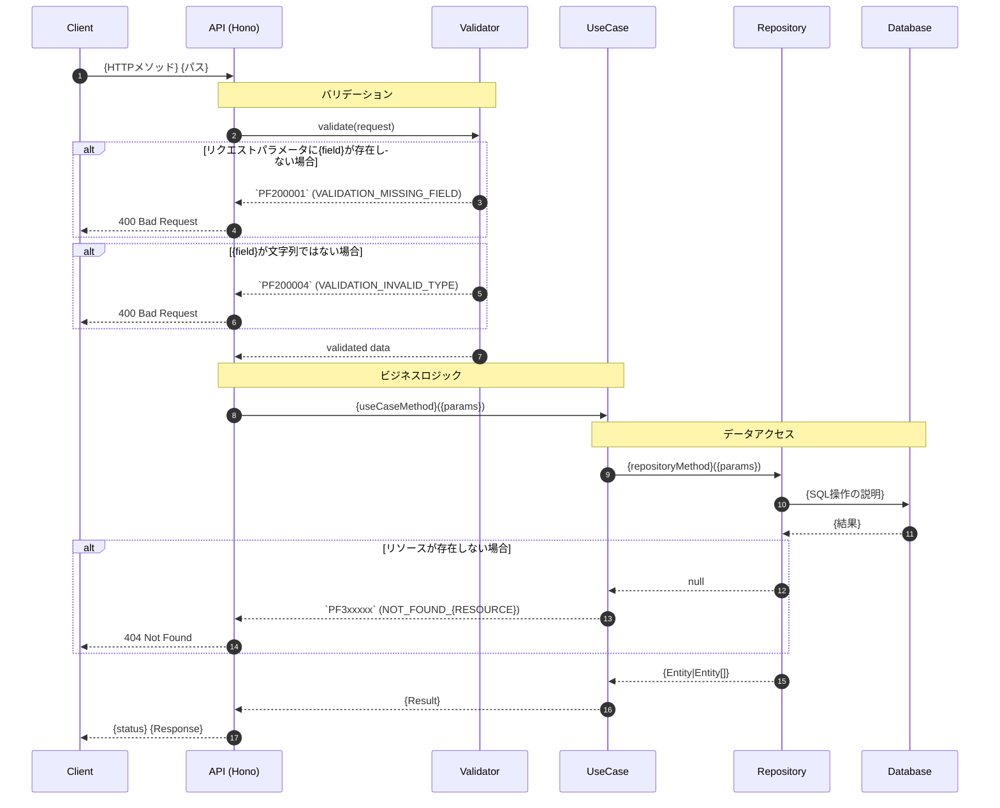
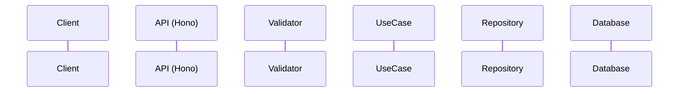

# シーケンス図テンプレート

## IMPORTANT: このテンプレートに従って一貫した形式でシーケンス図を作成すること

## 基本原則

1. **コード絶対主義**: 実装コードを100%正確に反映する
2. **簡略化禁止**: 既存コードの省略・簡略化は絶対禁止
3. **捏造禁止**: 存在しないコードを追加しない
4. **明示的検証**: すべての矢印に対応するコードが存在することを確認

## ファイル配置規則

```text
docs/sequence/
├── api/{domain}/{operation}.md      # APIシーケンス
├── web/{feature}/{operation}.md     # Webフロントエンド
└── admin/{feature}/{operation}.md   # 管理画面
```

## 命名規則

| 要素 | 規則 | 例 |
| ---- | ---- | -- |
| ファイル名 | ケバブケース、動詞-名詞 | `create-customer.md`, `list-posts.md` |
| 操作名 | 英語、動詞から開始 | Create, List, Update, Delete, Get |

## 用語規則

### 条件記述

| 使用する | 使用しない |
| -------- | ---------- |
| 〜の場合 | 〜のとき |
| 存在しない場合 | ない場合 |
| 〜が有効な場合 | 〜がtrueの場合 |

### バリデーション記述

| 使用する | 使用しない |
| -------- | ---------- |
| 文字列ではない場合 | 文字列型でない場合 |
| 空文字列の場合 | 空の場合 |
| {n}文字より長い場合 | {n}文字以上の場合 |

### 動詞

| 使用する | 説明 |
| -------- | ---- |
| 取得 | データを取得する |
| 格納 | 変数やフィールドに値を格納 |
| 追加 | コレクションに要素を追加 |
| 設定 | 値を設定 |
| 生成 | 新規に生成 |
| 作成 | リソースを作成 |

## テンプレート本体

````markdown
# {Operation Name}

## 概要

{このAPIの目的を1-2文で説明}

## エンドポイント

- **メソッド**: {GET|POST|PUT|PATCH|DELETE}
- **パス**: `/api/{path}`
- **認証**: {required|optional|none}

## 対象ファイル

| ファイルパス | レイヤー | 役割 |
| ------------ | -------- | ---- |
| `apps/api/src/interface/rest/{domain}.ts` | Handler | ルートハンドラ |
| `apps/api/src/application/usecases/{domain}/{operation}.ts` | UseCase | ビジネスロジック |
| `apps/api/src/infrastructure/repositories/{domain}.ts` | Repository | データアクセス |
| `packages/validation/src/{domain}.ts` | Validator | バリデーション |

## シーケンス



## リクエスト

### パスパラメータ

| 名前 | 型 | 必須 | 説明 | 例 | バリデーション |
| ---- | -- | ---- | ---- | -- | -------------- |
| {name} | string | Yes | {説明} | `example-slug` | 英数字、ハイフン、アンダースコアのみ |

### クエリパラメータ

| 名前 | 型 | 必須 | デフォルト | 説明 | バリデーション |
| ---- | -- | ---- | ---------- | ---- | -------------- |
| {name} | {type} | No | {default} | {説明} | {制約} |

### リクエストボディ

```typescript
interface RequestBody {
    {field}: {type};  // {説明} - {バリデーションルール}
}
```

## レスポンス

### 成功時 ({status})

```json
{
    "data": {
        // レスポンス構造
    }
}
```

## エラーコード一覧

| ステータス | PFコード | 定数名 | 説明 | 発生条件 |
| ---------- | -------- | ------ | ---- | -------- |
| 400 | `PF200001` | VALIDATION_MISSING_FIELD | 必須フィールド不足 | {field}が未指定 |
| 400 | `PF200004` | VALIDATION_INVALID_TYPE | 型が不正 | {field}が文字列ではない |
| 400 | `PF200002` | VALIDATION_INVALID_FORMAT | 形式が不正 | {field}の形式が不正 |
| 401 | `PF100003` | AUTH_UNAUTHORIZED | 認証エラー | 認証トークンが無効 |
| 403 | `PF100004` | AUTH_FORBIDDEN | 認可エラー | アクセス権限がない |
| 404 | `PF3xxxxx` | NOT_FOUND_{RESOURCE} | リソース未発見 | 指定IDが存在しない |
| 429 | `PF600001` | RATE_LIMIT_EXCEEDED | レート制限超過 | リクエスト数超過 |
| 500 | `PF400001` | INTERNAL_SERVER_ERROR | サーバーエラー | 予期せぬエラー |

> **PFコード体系**: `PF` + カテゴリ桁 + 5桁の番号
> - PF1xxxxx: 認証 (401/403)
> - PF2xxxxx: バリデーション (400)
> - PF3xxxxx: リソース未発見 (404)
> - PF4xxxxx: 内部エラー (500)
> - PF5xxxxx: 外部サービス (500)
> - PF6xxxxx: レート制限 (429)
> - PF7xxxxx: データベース (500)
> - PF8xxxxx: キャッシュ (500)

## 外部システム呼び出しまとめ

| 順序 | 対象 | 操作 | 内容 | ファイル |
| ---- | ---- | ---- | ---- | -------- |
| 1 | DB | SELECT | {テーブル}から{条件}で取得 | `{repository-file}:{line}` |
| 2 | DB | INSERT | {テーブル}に{データ}を挿入 | `{repository-file}:{line}` |

## 実装参照

| レイヤー | ファイル | 関数/クラス | 行番号 |
| -------- | -------- | ----------- | ------ |
| Router | `apps/api/src/interface/rest/{domain}.ts` | `{handler}` | L{n} |
| UseCase | `apps/api/src/application/usecases/{domain}/{operation}.ts` | `{UseCase}` | L{n} |
| Repository | `apps/api/src/infrastructure/repositories/{domain}.ts` | `{Repository}` | L{n} |
| Entity | `apps/api/src/domain/entities/{entity}.ts` | `{Entity}` | L{n} |
| Validator | `packages/validation/src/{domain}.ts` | `{schema}` | L{n} |

## 関連

- API仕様: `docs/specs/api/{domain}.md`
- DB仕様: `docs/specs/db/{domain}.md`
- テスト: `apps/api/tests/medium/{domain}/{operation}.medium.test.ts`
````

## Mermaidシーケンス図の記法ルール

### 基本構造



### 矢印の使い分け

| 矢印 | 用途 | 例 |
| ---- | ---- | -- |
| `->` | 自己呼び出し | `A->A: ログ出力` |
| `->>` | リクエスト | `C->>A: GET /api/posts` |
| `-->>` | レスポンス | `A-->>C: 200 OK` |

### 制御フロー

| 構文 | 用途 | 使用場面 |
| ---- | ---- | -------- |
| `alt / else / end` | 条件分岐 | 排他的な分岐 |
| `opt / end` | 条件付き処理 | 早期リターン |
| `loop / end` | 繰り返し | **外部システム呼び出しのみ** |
| `Note over A,B` | 注釈 | レイヤーの説明 |

### loopの使用ルール（重要）

```text
loop は外部システム（DB, API, Redis）への呼び出しにのみ使用する。
内部ロジックのループには loop を使用しない。
```

### エラーコードの記法

```text
エラーコードはPF形式でバッククォートで囲み、括弧内に定数名を記載:
`PF200001` (VALIDATION_MISSING_FIELD)
```

## セルフレビューチェックリスト

### 適合性確認

- [ ] 概要が明確に記述されている
- [ ] エンドポイント情報が完全
- [ ] 対象ファイル一覧が正確

### 整合性と正確性

- [ ] シーケンス図がコードと完全に一致している
- [ ] 存在しないコードが追加されていない
- [ ] 既存コードが省略・簡略化されていない
- [ ] すべてのエラーパスが網羅されている

### 記法と形式

- [ ] Mermaid構文が正しい
- [ ] エラーコードがバッククォートで囲まれている
- [ ] 用語規則に従っている

### 日本語表記

- [ ] 条件記述が「〜の場合」形式
- [ ] 動詞が規定の形式

## 作成手順

1. **対象ファイルの特定**: 実装ファイルを`Read`ツールで読み込む
2. **コードリーディング**: 処理フローを完全に理解する
3. **シーケンス図作成**: テンプレートに従って作成
4. **セルフレビュー**: チェックリストで検証
5. **関連ドキュメント更新**: API仕様、テストとの整合性確認
