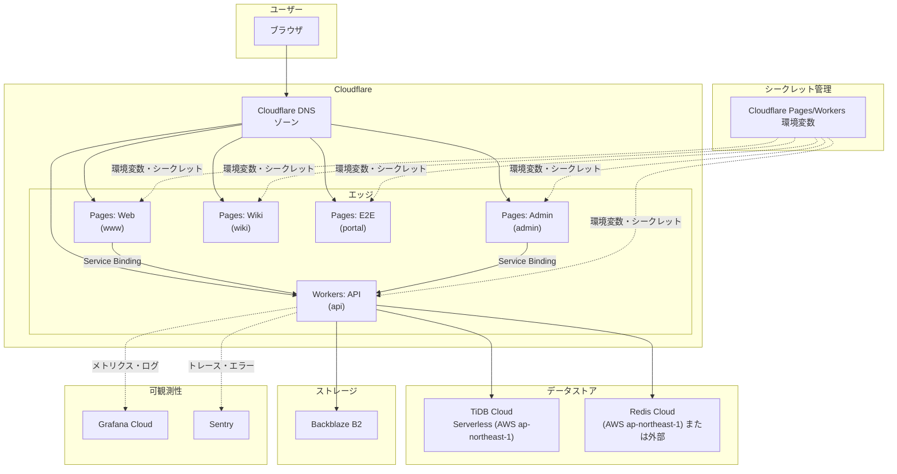
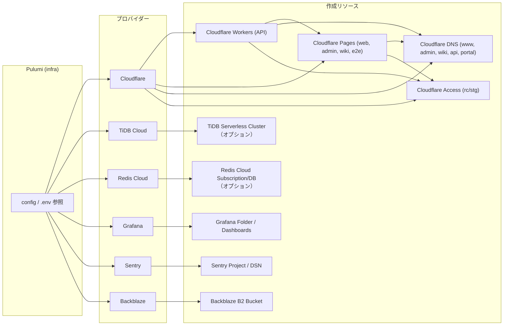

このドキュメントは、`infra/` ディレクトリで Pulumi により管理されるインフラストラクチャの構成とコンポーネントの関係を図示します。

> **注意**: 本ドキュメントの構成図（ランタイム構成図・プロビジョニング構成図）は**Pulumiから自動生成されています**。
> `infra` で `bun run generate` を実行すると再生成されます。
> 仕様駆動開発の観点から、手動で書くべき仕様は [`docs/specs/infra/`](../specs/infra/) に記載しています。

**Pulumi のデフォルトコマンドで生成したリソース依存グラフ**: デプロイ済みスタックから `pulumi stack graph` で自動生成した図は [infra-stack-graph.md](./infra-stack-graph.md) を参照してください。`infra` で `bun run generate` を実行すると再生成されます。

## ランタイム構成図

ユーザーリクエストが DNS を経由して Cloudflare に到達し、Pages（Web/Admin/Wiki）と Workers（API）に振り分けられ、API が TiDB と Redis を利用する流れです。

## プロビジョニング構成図

Pulumi がどのプロバイダーとリソースを順に作成・参照するかを示します。

## コンポーネント一覧

カテゴリ・コンポーネント・対応する infra リソースは実装の変更に伴い変わるため、一覧はこのドキュメントでは持たず、**`infra/` 配下の Pulumi リソース（`resources/*.ts`）を直接参照**すること。

## 環境とスタック

- **Pulumi スタック**: `prd`, `stg`, `rc` など（`Pulumi.*.yaml`）
- **環境変数**: `infra/.env` を読み、Pulumi で Cloudflare Pages/Workers に反映
- **Cloudflare Access**: プレビュー用の Access アプリは `rc` / `stg` のみ作成

## 関連ドキュメント

- [Architecture Overview](./overview.md)
- [インフラ仕様書](../specs/infra/overview.md) - 手動管理する仕様
- [APIキー・トークン発行手順](../development/api-keys-setup.md)
