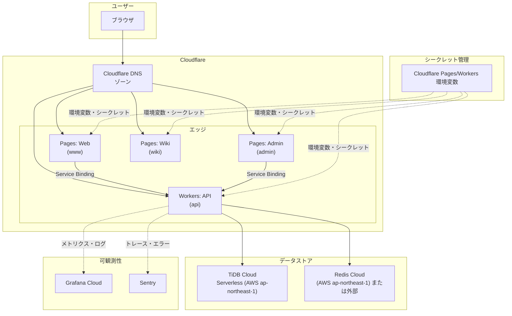
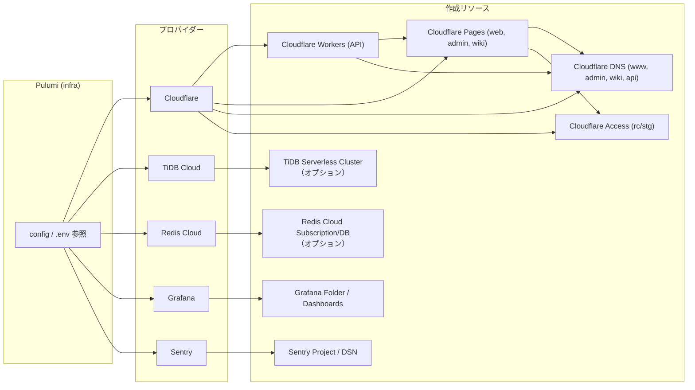

このドキュメントは、`infra/` ディレクトリで Pulumi により管理されるインフラストラクチャの構成とコンポーネントの関係を図示します。

**Pulumi のデフォルトコマンドで生成したリソース依存グラフ**: デプロイ済みスタックから `pulumi stack graph` で自動生成した図は [infra-stack-graph.md](./infra-stack-graph.md) を参照してください。`infra` で `bun run generate` を実行すると再生成されます。

## 概要

インフラは **Pulumi** で IaC 化され、**Cloudflare**（Workers / Pages / DNS および環境変数）、**TiDB Cloud**・**Redis Cloud**（データストア）、**Grafana**・**Sentry**（可観測性）を統合しています。

## ランタイム構成図

ユーザーリクエストが DNS を経由して Cloudflare に到達し、Pages（Web/Admin/Wiki）と Workers（API）に振り分けられ、API が TiDB と Redis を利用する流れです。

## プロビジョニング構成図

Pulumi がどのプロバイダーとリソースを順に作成・参照するかを示します。

## コンポーネント一覧

| カテゴリ | コンポーネント | 説明 | infra リソース |
| ---------- | ---------------- | ------ | ---------------- |
| シークレット | Cloudflare Pages/Workers | 環境変数は `infra/.env` から Pulumi で Cloudflare に反映 | `resources/secrets.ts` |
| コンピュート | Cloudflare Workers | Hono API（api サブドメイン） | `resources/workers.ts` |
| コンピュート | Cloudflare Pages | Web (www)、Admin (admin)、Wiki (wiki)。Web/Admin は API Worker に Service Binding | `resources/pages.ts` |
| ネットワーク | Cloudflare DNS | www, admin, wiki, api の CNAME（Pages/Workers 向け） | `resources/dns.ts` |
| アクセス制御 | Cloudflare Access | rc/stg 環境でプレビュー用 Zero Trust（admin, api, web, wiki） | `resources/access.ts` |
| データベース | TiDB Cloud | Serverless（AWS ap-northeast-1）。自動作成または外部 DATABASE_URL | `resources/databases.ts` |
| キャッシュ | Redis Cloud | AWS ap-northeast-1。自動作成または外部 CACHE_URL | `resources/cache.ts` |
| 可観測性 | Grafana | フォルダ・ダッシュボード | `resources/observability.ts` |
| 可観測性 | Sentry | プロジェクト・DSN（エラー追跡） | `resources/observability.ts` |

## 環境とスタック

- **Pulumi スタック**: `prd`, `stg`, `rc` など（`Pulumi.*.yaml`）
- **環境変数**: `infra/.env` を読み、Pulumi で Cloudflare Pages/Workers に反映
- **Cloudflare Access**: プレビュー用の Access アプリは `rc` / `stg` のみ作成

## 関連ドキュメント

- [Architecture Overview](./overview.md)
- [APIキー・トークン発行手順](../development/api-keys-setup.md)
