# データベース設計書

> Generated by [`prisma-markdown`](https://github.com/samchon/prisma-markdown)

- [default](#default)

## default

```mermaid
erDiagram
"user" {
  String id PK
  String name
  String email UK
  Boolean emailVerified
  String image "nullable"
  String bio "nullable"
  DateTime createdAt
  DateTime updatedAt
}
"session" {
  String id PK
  DateTime expiresAt
  String token UK
  DateTime createdAt
  DateTime updatedAt
  String ipAddress "nullable"
  String userAgent "nullable"
  String userId FK
}
"account" {
  String id PK
  String accountId
  String providerId
  String userId FK
  String accessToken "nullable"
  String refreshToken "nullable"
  String idToken "nullable"
  DateTime accessTokenExpiresAt "nullable"
  DateTime refreshTokenExpiresAt "nullable"
  String scope "nullable"
  String password "nullable"
  DateTime createdAt
  DateTime updatedAt
}
"verification" {
  String id PK
  String identifier
  String value
  DateTime expiresAt
  DateTime createdAt
  DateTime updatedAt
}
"chat_rooms" {
  String id PK
  String customer_id FK "nullable"
  String inquiry_id FK,UK "nullable"
  String name "nullable"
  ChatRoomStatus status
  String metadata "nullable"
  DateTime closed_at "nullable"
  DateTime created_at
  DateTime updated_at
}
"chat_participants" {
  String id PK
  String chat_room_id FK
  String user_id FK "nullable"
  String name
  ChatParticipantRole role
  Boolean is_online
  DateTime last_seen_at "nullable"
  DateTime joined_at
  DateTime left_at "nullable"
  DateTime created_at
  DateTime updated_at
}
"chat_messages" {
  String id PK
  String chat_room_id FK
  String participant_id FK
  ChatMessageType type
  String content
  String metadata "nullable"
  String read_by "nullable"
  DateTime created_at
  DateTime updated_at
}
"customers" {
  String id PK
  String name
  String email "nullable"
  String phone "nullable"
  String company "nullable"
  String website "nullable"
  String address "nullable"
  String notes "nullable"
  CustomerStatus status
  String tags "nullable"
  String custom_fields "nullable"
  DateTime created_at
  DateTime updated_at
}
"leads" {
  String id PK
  String customer_id FK "nullable"
  String name
  String email "nullable"
  String phone "nullable"
  String company "nullable"
  String source "nullable"
  LeadStatus status
  Int score "nullable"
  String notes "nullable"
  DateTime converted_at "nullable"
  DateTime created_at
  DateTime updated_at
}
"pipelines" {
  String id PK
  String name
  String description "nullable"
  Boolean is_default
  DateTime created_at
  DateTime updated_at
}
"pipeline_stages" {
  String id PK
  String pipeline_id FK
  String name
  Int order
  Int probability "nullable"
  String color "nullable"
  DateTime created_at
  DateTime updated_at
}
"deals" {
  String id PK
  String customer_id FK "nullable"
  String lead_id FK,UK "nullable"
  String stage_id FK
  String name
  Decimal(15) value "nullable"
  String currency
  DateTime expected_close_date "nullable"
  DateTime actual_close_date "nullable"
  DealStatus status
  String notes "nullable"
  String lost_reason "nullable"
  DateTime created_at
  DateTime updated_at
}
"contact_histories" {
  String id PK
  String customer_id FK
  String user_id FK "nullable"
  ContactType type
  String subject "nullable"
  String content "nullable"
  DateTime contacted_at
  DateTime created_at
  DateTime updated_at
}
"email_logs" {
  String id PK
  String customer_id FK "nullable"
  String template_id FK "nullable"
  String resend_id "nullable"
  String from_email
  String to_email
  String cc_email "nullable"
  String bcc_email "nullable"
  String subject
  String html_content "nullable"
  String text_content "nullable"
  EmailStatus status
  String error_message "nullable"
  DateTime sent_at "nullable"
  DateTime delivered_at "nullable"
  DateTime opened_at "nullable"
  DateTime clicked_at "nullable"
  DateTime bounced_at "nullable"
  String metadata "nullable"
  DateTime created_at
  DateTime updated_at
}
"email_templates" {
  String id PK
  String name
  String slug UK
  String description "nullable"
  EmailTemplateCategory category
  String subject
  String html_content
  String text_content "nullable"
  String variables "nullable"
  Boolean is_active
  DateTime created_at
  DateTime updated_at
}
"inquiries" {
  String id PK
  String customer_id FK "nullable"
  String assignee_id FK "nullable"
  String subject
  String content
  InquiryStatus status
  InquiryPriority priority
  InquiryCategory category
  String tags "nullable"
  String source "nullable"
  String metadata "nullable"
  DateTime resolved_at "nullable"
  DateTime closed_at "nullable"
  DateTime created_at
  DateTime updated_at
}
"inquiry_responses" {
  String id PK
  String inquiry_id FK
  String user_id FK "nullable"
  String content
  Boolean is_internal
  String attachments "nullable"
  DateTime created_at
  DateTime updated_at
}
"freee_integrations" {
  String id PK
  String user_id FK
  Int company_id
  String company_name "nullable"
  String access_token
  String refresh_token
  DateTime token_expires_at
  String scopes "nullable"
  Boolean is_active
  DateTime last_sync_at "nullable"
  DateTime created_at
  DateTime updated_at
}
"freee_sync_logs" {
  String id PK
  String integration_id FK
  SyncDirection direction
  SyncStatus status
  String entity_type
  Int total_records "nullable"
  Int success_count "nullable"
  Int error_count "nullable"
  String error_details "nullable"
  DateTime started_at "nullable"
  DateTime completed_at "nullable"
  DateTime created_at
  DateTime updated_at
}
"customer_freee_mappings" {
  String id PK
  String customer_id FK
  Int freee_partner_id
  Int freee_company_id
  DateTime last_sync_at
  String sync_hash "nullable"
  DateTime created_at
  DateTime updated_at
}
"deal_freee_mappings" {
  String id PK
  String deal_id FK
  Int freee_deal_id
  Int freee_company_id
  DateTime last_sync_at
  String sync_hash "nullable"
  DateTime created_at
  DateTime updated_at
}
"portfolios" {
  String id PK
  String title
  String slug UK
  String company
  DateTime date
  Boolean current
  String overview "nullable"
  String description "nullable"
  String content "nullable"
  String thumbnail_temp "nullable"
  String intro "nullable"
  DateTime created_at
  DateTime updated_at
}
"portfolio_images" {
  String id PK
  String portfolio_id FK
  String url
}
"posts" {
  String id PK
  String title
  String slug UK
  DateTime date
  String description "nullable"
  String content
  String content_raw "nullable"
  String image_temp
  Boolean sticky
  String intro "nullable"
  DateTime created_at
  DateTime updated_at
}
"tags" {
  String id PK
  String name UK
}
"post_tags" {
  String post_id FK
  String tag_id FK
}
"post_images" {
  String id PK
  String post_id FK
  String url
}
"user_experiences" {
  String id PK
  String user_id FK
  String company
  String company_url
  Boolean contract "nullable"
  String date
  DateTime date_start "nullable"
  DateTime date_end "nullable"
  String description
  String highlights
  String image "nullable"
  String tags
  String title
  DateTime created_at
  DateTime updated_at
}
"user_socials" {
  String id PK
  String user_id FK
  String icon
  String title
  String url
  DateTime created_at
  DateTime updated_at
}
"session" }o--|| "user" : user
"account" }o--|| "user" : user
"chat_rooms" }o--o| "customers" : customer
"chat_rooms" |o--o| "inquiries" : inquiry
"chat_participants" }o--|| "chat_rooms" : chatRoom
"chat_participants" }o--o| "user" : user
"chat_messages" }o--|| "chat_rooms" : chatRoom
"chat_messages" }o--|| "chat_participants" : participant
"leads" }o--o| "customers" : customer
"pipeline_stages" }o--|| "pipelines" : pipeline
"deals" }o--o| "customers" : customer
"deals" |o--o| "leads" : lead
"deals" }o--|| "pipeline_stages" : stage
"contact_histories" }o--|| "customers" : customer
"contact_histories" }o--o| "user" : user
"email_logs" }o--o| "customers" : customer
"email_logs" }o--o| "email_templates" : template
"inquiries" }o--o| "customers" : customer
"inquiries" }o--o| "user" : assignee
"inquiry_responses" }o--|| "inquiries" : inquiry
"inquiry_responses" }o--o| "user" : user
"freee_integrations" }o--|| "user" : user
"freee_sync_logs" }o--|| "freee_integrations" : integration
"customer_freee_mappings" }o--|| "customers" : customer
"deal_freee_mappings" }o--|| "deals" : deal
"portfolio_images" }o--|| "portfolios" : portfolio
"post_tags" }o--|| "posts" : post
"post_tags" }o--|| "tags" : tag
"post_images" }o--|| "posts" : post
"user_experiences" }o--|| "user" : user
"user_socials" }o--|| "user" : user
```

### `user`

Properties as follows:

- `id`:
- `name`:
- `email`:
- `emailVerified`:
- `image`:
- `bio`:
- `createdAt`:
- `updatedAt`:

### `session`

Properties as follows:

- `id`:
- `expiresAt`:
- `token`:
- `createdAt`:
- `updatedAt`:
- `ipAddress`:
- `userAgent`:
- `userId`:

### `account`

Properties as follows:

- `id`:
- `accountId`:
- `providerId`:
- `userId`:
- `accessToken`:
- `refreshToken`:
- `idToken`:
- `accessTokenExpiresAt`:
- `refreshTokenExpiresAt`:
- `scope`:
- `password`:
- `createdAt`:
- `updatedAt`:

### `verification`

Properties as follows:

- `id`:
- `identifier`:
- `value`:
- `expiresAt`:
- `createdAt`:
- `updatedAt`:

### `chat_rooms`

Properties as follows:

- `id`:
- `customer_id`:
- `inquiry_id`:
- `name`:
- `status`:
- `metadata`:
- `closed_at`:
- `created_at`:
- `updated_at`:

### `chat_participants`

Properties as follows:

- `id`:
- `chat_room_id`:
- `user_id`:
- `name`:
- `role`:
- `is_online`:
- `last_seen_at`:
- `joined_at`:
- `left_at`:
- `created_at`:
- `updated_at`:

### `chat_messages`

Properties as follows:

- `id`:
- `chat_room_id`:
- `participant_id`:
- `type`:
- `content`:
- `metadata`:
- `read_by`:
- `created_at`:
- `updated_at`:

### `customers`

Properties as follows:

- `id`:
- `name`:
- `email`:
- `phone`:
- `company`:
- `website`:
- `address`:
- `notes`:
- `status`:
- `tags`:
- `custom_fields`:
- `created_at`:
- `updated_at`:

### `leads`

Properties as follows:

- `id`:
- `customer_id`:
- `name`:
- `email`:
- `phone`:
- `company`:
- `source`:
- `status`:
- `score`:
- `notes`:
- `converted_at`:
- `created_at`:
- `updated_at`:

### `pipelines`

Properties as follows:

- `id`:
- `name`:
- `description`:
- `is_default`:
- `created_at`:
- `updated_at`:

### `pipeline_stages`

Properties as follows:

- `id`:
- `pipeline_id`:
- `name`:
- `order`:
- `probability`:
- `color`:
- `created_at`:
- `updated_at`:

### `deals`

Properties as follows:

- `id`:
- `customer_id`:
- `lead_id`:
- `stage_id`:
- `name`:
- `value`:
- `currency`:
- `expected_close_date`:
- `actual_close_date`:
- `status`:
- `notes`:
- `lost_reason`:
- `created_at`:
- `updated_at`:

### `contact_histories`

Properties as follows:

- `id`:
- `customer_id`:
- `user_id`:
- `type`:
- `subject`:
- `content`:
- `contacted_at`:
- `created_at`:
- `updated_at`:

### `email_logs`

Properties as follows:

- `id`:
- `customer_id`:
- `template_id`:
- `resend_id`:
- `from_email`:
- `to_email`:
- `cc_email`:
- `bcc_email`:
- `subject`:
- `html_content`:
- `text_content`:
- `status`:
- `error_message`:
- `sent_at`:
- `delivered_at`:
- `opened_at`:
- `clicked_at`:
- `bounced_at`:
- `metadata`:
- `created_at`:
- `updated_at`:

### `email_templates`

Properties as follows:

- `id`:
- `name`:
- `slug`:
- `description`:
- `category`:
- `subject`:
- `html_content`:
- `text_content`:
- `variables`:
- `is_active`:
- `created_at`:
- `updated_at`:

### `inquiries`

Properties as follows:

- `id`:
- `customer_id`:
- `assignee_id`:
- `subject`:
- `content`:
- `status`:
- `priority`:
- `category`:
- `tags`:
- `source`:
- `metadata`:
- `resolved_at`:
- `closed_at`:
- `created_at`:
- `updated_at`:

### `inquiry_responses`

Properties as follows:

- `id`:
- `inquiry_id`:
- `user_id`:
- `content`:
- `is_internal`:
- `attachments`:
- `created_at`:
- `updated_at`:

### `freee_integrations`

Properties as follows:

- `id`:
- `user_id`:
- `company_id`:
- `company_name`:
- `access_token`:
- `refresh_token`:
- `token_expires_at`:
- `scopes`:
- `is_active`:
- `last_sync_at`:
- `created_at`:
- `updated_at`:

### `freee_sync_logs`

Properties as follows:

- `id`:
- `integration_id`:
- `direction`:
- `status`:
- `entity_type`:
- `total_records`:
- `success_count`:
- `error_count`:
- `error_details`:
- `started_at`:
- `completed_at`:
- `created_at`:
- `updated_at`:

### `customer_freee_mappings`

Properties as follows:

- `id`:
- `customer_id`:
- `freee_partner_id`:
- `freee_company_id`:
- `last_sync_at`:
- `sync_hash`:
- `created_at`:
- `updated_at`:

### `deal_freee_mappings`

Properties as follows:

- `id`:
- `deal_id`:
- `freee_deal_id`:
- `freee_company_id`:
- `last_sync_at`:
- `sync_hash`:
- `created_at`:
- `updated_at`:

### `portfolios`

Properties as follows:

- `id`:
- `title`:
- `slug`:
- `company`:
- `date`:
- `current`:
- `overview`:
- `description`:
- `content`:
- `thumbnail_temp`:
- `intro`:
- `created_at`:
- `updated_at`:

### `portfolio_images`

Properties as follows:

- `id`:
- `portfolio_id`:
- `url`:

### `posts`

Properties as follows:

- `id`:
- `title`:
- `slug`:
- `date`:
- `description`:
- `content`:
- `content_raw`:
- `image_temp`:
- `sticky`:
- `intro`:
- `created_at`:
- `updated_at`:

### `tags`

Properties as follows:

- `id`:
- `name`:

### `post_tags`

Properties as follows:

- `post_id`:
- `tag_id`:

### `post_images`

Properties as follows:

- `id`:
- `post_id`:
- `url`:

### `user_experiences`

Properties as follows:

- `id`:
- `user_id`:
- `company`:
- `company_url`:
- `contract`:
- `date`:
- `date_start`:
- `date_end`:
- `description`:
- `highlights`:
- `image`:
- `tags`:
- `title`:
- `created_at`:
- `updated_at`:

### `user_socials`

Properties as follows:

- `id`:
- `user_id`:
- `icon`:
- `title`:
- `url`:
- `created_at`:
- `updated_at`:
