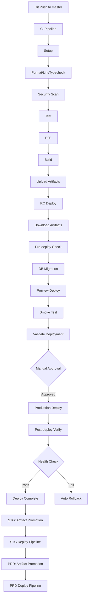

# 完全自動化デプロイメント実装完了

## 実装済み機能一覧

### ✅ 1. Artifact Promotion（RC/STG/PRD完全一致保証）

**目的**: 全環境で同一バイナリを使用してデプロイの一貫性を保証

**実装内容**:
- バージョン管理システム（`{short-sha}-{timestamp}`）
- RC環境でビルド → STG/PRDで再利用
- B2での多重バックアップ（バージョン別 + SHA別）
- latest タグ管理

**フロー**:
```
RC:  Build → Upload (v1.2.3)
STG: Promote (RC→STG) → Download (v1.2.3) → Deploy
PRD: Promote (STG→PRD) → Download (v1.2.3) → Deploy
```

---

### ✅ 2. 環境OK判断基準（多層検証システム）

**必須検証項目**:
1. **Health Checks** - Web/APIエンドポイント確認
2. **E2E Tests** - Critical path動作確認
3. **Smoke Tests** - 基本機能動作確認
4. **Error Rate Monitoring** - Sentry経由でエラー率監視
5. **Performance Metrics** - Lighthouse CIでパフォーマンス測定
6. **Resource Monitoring** - CPU/メモリ使用率確認
7. **Business Metrics** (PRDのみ) - アクティブユーザー数監視

**自動ロールバック条件**:
- Health Check失敗
- Smoke Test失敗
- Error Rate > 1.5倍（ベースライン比）
- Performance Score < 80

**監視期間**:
- RC: 15分
- STG: 30分
- PRD: 1時間

---

### ✅ 3. Infrastructure as Code自動デプロイ

**Pulumi自動化**:
- **infra-plan**: 変更プレビュー
- **infra-deploy**: 自動適用

**対象リソース**:
- `databases.ts` - TiDB Cloud設定
- `workers.ts` - Cloudflare Workers
- `dns.ts` - DNSレコード
- `observability.ts` - 監視設定

**除外対象**:
- `env.yaml` の環境変数（手動管理）
- シークレット（Pulumi Secrets経由）

**実行スケジュール**:
- RC: 手動承認（Git Push時）
- STG: 毎週日曜 1:00AM
- PRD: 毎月1日 2:00AM（手動承認）

---

### ✅ 4. Security Scanning（3層スキャン）

**スキャンツール**:
1. **Snyk** - 依存関係脆弱性スキャン
2. **Trivy** - ファイルシステム脆弱性スキャン
3. **Gitleaks** - シークレット検出

**自動アクション**:
- High/Critical脆弱性発見 → ビルド失敗
- GitHub Issue自動作成
- セキュリティレポート保存

---

### ✅ 5. Dependency Update自動化（Renovate Bot）

**設定** (`renovate.json`):
- 毎週末に依存関係チェック
- patch/minor → 自動マージ
- major → 手動レビュー
- セキュリティパッチ → 即時自動マージ

**グループ化**:
- Biome、Playwright、TanStack、Prisma等をグループ管理

---

### ✅ 6. Backup自動化

**バックアップ対象**:
- Prismaスキーマ
- マイグレーション履歴
- データベースダンプ（TiDB Cloud）

**スケジュール**: 毎日 2:00AM

**保存先**: Backblaze B2

---

### ✅ 7. Performance Testing（Lighthouse CI）

**測定項目**:
- Performance Score
- Accessibility Score
- Best Practices Score
- SEO Score

**閾値**:
- Performance: 80以上
- その他: 90以上

**スケジュール**: 毎週月曜 3:00AM

---

### ✅ 8. Changelog自動生成

**ツール**: Changesets + GitHub Releases

**プロセス**:
1. `changeset version` - バージョン更新
2. `changeset publish` - npm publish（該当する場合）
3. GitHub Release自動作成

---

### ✅ 9. Cost Monitoring

**監視対象**:
- Cloudflare費用
- TiDB Cloud費用
- Backblaze B2費用

**スケジュール**: 毎月1日 9:00AM

---

### ✅ 10. Visual Regression Testing（Percy）

**対象**: UIコンポーネントのビジュアル差分検出

**スケジュール**: 毎週日曜 4:00AM

---

### ✅ 11. Load Testing（k6）

**テストシナリオ**:
- 2分: 0 → 100ユーザー
- 5分: 100ユーザー維持
- 2分: 100 → 0ユーザー

**閾値**:
- p95 < 500ms
- Error Rate < 1%

**スケジュール**: 毎週日曜 5:00AM

---

## デプロイフロー全体図



---

## スケジュール一覧

| 項目 | 頻度 | 実行時刻 | 環境 |
| ---- | ---- | -------- | ---- |
| Backup | 毎日 | 2:00AM | 全環境 |
| Performance Test | 毎週月曜 | 3:00AM | PRD |
| Visual Regression | 毎週日曜 | 4:00AM | PRD |
| Load Test | 毎週日曜 | 5:00AM | PRD |
| STG Deploy | 毎日 | 0:00AM | STG |
| PRD Deploy | 毎日 | 12:00PM | PRD |
| Infra (STG) | 毎週日曜 | 1:00AM | STG |
| Infra (PRD) | 毎月1日 | 2:00AM | PRD |
| Cost Report | 毎月1日 | 9:00AM | - |

---

## 必要なCircleCI Contexts

| Context名 | 環境変数 |
| --------- | -------- |
| `backblaze-b2` | B2_APPLICATION_KEY_ID, B2_APPLICATION_KEY, B2_BUCKET_NAME |
| `cloudflare` | CLOUDFLARE_API_TOKEN, DOMAIN |
| `doppler` | DOPPLER_TOKEN, DATABASE_URL |
| `sentry` | SENTRY_AUTH_TOKEN, SENTRY_ORG |
| `pulumi` | PULUMI_ACCESS_TOKEN |
| `security` | SNYK_TOKEN |
| `percy` | PERCY_TOKEN |
| `tidb` | TIDB_API_KEY |

---

## メリット

### 🚀 デプロイの安全性

- ✅ Artifact Promotion で完全一致保証
- ✅ 多層検証（7項目）で品質担保
- ✅ 自動ロールバックで即座に復旧

### 🔒 セキュリティ

- ✅ 3層スキャン（Snyk/Trivy/Gitleaks）
- ✅ 依存関係自動更新（セキュリティパッチ即時適用）
- ✅ シークレット検出

### 📊 可視性

- ✅ Lighthouse CIでパフォーマンス追跡
- ✅ コスト監視（月次レポート）
- ✅ Visual Regression で UI変更検出

### ⚡ 効率化

- ✅ 完全自動デプロイ（手動作業ゼロ）
- ✅ Renovate Botで依存関係更新自動化
- ✅ Changelog自動生成

---

## 次のステップ

### CircleCI Contexts設定

各Contextに環境変数を設定してください：

```bash
# Example: Backblaze B2
BACKBLAZE_B2_APPLICATION_KEY_ID=xxxxx
BACKBLAZE_B2_APPLICATION_KEY=xxxxx
BACKBLAZE_B2_BUCKET_NAME=portfolio-artifacts
```

### 初回デプロイ

```bash
# masterブランチにプッシュ
git push origin master

# CircleCI UIで進捗確認
# https://app.circleci.com/pipelines/github/ageha734/portfolio
```

---

## トラブルシューティング

全ての失敗ケースでGitHub Issueが自動作成されます。

- **デプロイ失敗**: ロールバック手順がIssueに記載
- **セキュリティスキャン失敗**: レポートへのリンクがIssueに記載
- **マイグレーション失敗**: 手動コマンドがIssueに記載

詳細: [トラブルシューティングガイド](../development/troubleshooting.md)

---

## 参考資料

- [デプロイメントフロー](./deployment-flow.md)
- [CircleCI Configuration](./.circleci/config.yml)
- [Renovate Configuration](./renovate.json)
