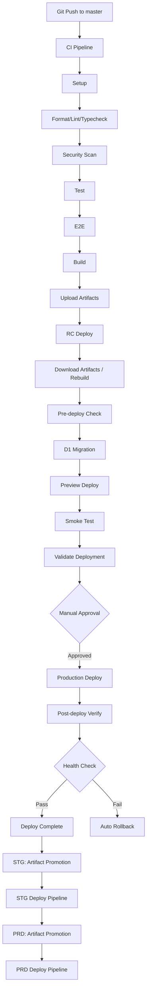

# 完全自動化デプロイメント実装完了

## 実装済み機能一覧

### ✅ 1. Artifact Promotion（RC/STG/PRD完全一致保証）

**目的**: 全環境で同一バイナリを使用してデプロイの一貫性を保証

**実装内容**:

- バージョン管理システム（`{short-sha}-{timestamp}`）
- RC環境でビルド → STG/PRDで再利用（方針）
- CircleCI Artifacts（`store_artifacts` / workspace）への保存
- latest タグ管理

**フロー**:

```text
RC:  Build → Upload (CircleCI Artifacts, v1.2.3)
STG: Promote (RC→STG) → Download / Rebuild → Deploy
PRD: Promote (STG→PRD) → Download / Rebuild → Deploy
```

実際のデプロイ workflow はソース再ビルドしてデプロイする構成です。詳細は `.circleci/config.yml` および [CI/CDツール](../development/ci-cd-tools.md) を参照。

### ✅ 2. 環境OK判断基準（多層検証システム）

**必須検証項目**:

1. **Health Checks** - Web/APIエンドポイント確認
2. **E2E Tests** - Critical path動作確認
3. **Smoke Tests** - 基本機能動作確認
4. **Error Rate Monitoring** - Sentry経由でエラー率監視
5. **Performance Metrics** - Lighthouse CIでパフォーマンス測定
6. **Resource Monitoring** - CPU/メモリ使用率確認
7. **Business Metrics** (PRDのみ) - アクティブユーザー数監視

**自動ロールバック条件**:

- Health Check失敗
- Smoke Test失敗
- Error Rate > 1.5倍（ベースライン比）
- Performance Score < 80

**監視期間**:

- RC: 15分
- STG: 30分
- PRD: 1時間

### ✅ 3. Infrastructure as Code自動デプロイ

**Pulumi自動化**:

- **infra-plan**: 変更プレビュー
- **infra-deploy**: 自動適用

**対象リソース**（`infra/src/resources/`）:

- `cloudflare-data.ts` - Cloudflare D1 / Workers KV / R2
- `workers.ts` - Cloudflare Workers（API）
- `pages.ts` - Cloudflare Pages
- `dns.ts` - DNSレコード
- `access.ts` - Cloudflare Access（rc/stg）
- `observability.ts` - Sentry 等の監視設定
- `secrets.ts` - シークレット連携

**環境変数管理**:

- `env.yaml` - ローカルで管理、CircleCIにbase64エンコードしてアップロード
- `infra/scripts/upload-env-to-circleci.sh` - 自動アップロードスクリプト
- CircleCI側で自動デコードして使用

**実行トリガー**:

- RC: Git Push 後、手動承認
- STG: RC 成功後、手動承認
- PRD: STG 成功後、手動承認（plan 後にも再承認）

### ✅ 4. Security Scanning（3層スキャン）

**スキャンツール**:

1. **Snyk** - 依存関係脆弱性スキャン
2. **Trivy** - ファイルシステム脆弱性スキャン
3. **Gitleaks** - シークレット検出

**自動アクション**:

- High/Critical脆弱性発見 → ビルド失敗
- GitHub Issue自動作成
- セキュリティレポート保存

### ✅ 5. Dependency Update自動化

**方針**: Renovate は使用しない。Claude Code（`/update-deps`）で月次またはセキュリティパッチ時に更新。

詳細: [CI/CDツール](../development/ci-cd-tools.md)

### ✅ 6. Backup自動化

**バックアップ対象**:

- Prismaスキーマ
- マイグレーション履歴（`packages/db/migrations/`）
- データベース: Cloudflare D1 Time Travel / Dashboard によるポイントインタイム復元

**スケジュール**: 毎日 2:00AM（メタデータ・スキーマ系）。DB本体は D1 の Time Travel に依存。

**保存先**: CircleCI Artifacts（ビルド成果物） / D1 Time Travel（DB）

### ✅ 7. Performance Testing（Lighthouse CI）

**測定項目**:

- Performance Score
- Accessibility Score
- Best Practices Score
- SEO Score

**閾値**:

- Performance: 80以上
- その他: 90以上

**スケジュール**: 毎週月曜 3:00AM

### ✅ 8. Changelog自動生成

**ツール**: Changesets + GitHub Releases

**プロセス**:

1. `changeset version` - バージョン更新
2. `changeset publish` - npm publish（該当する場合）
3. GitHub Release自動作成

### ✅ 9. Cost Monitoring

**監視対象**:

- Cloudflare費用（Pages / Workers / D1 / KV / R2）

**スケジュール**: 毎月1日 9:00AM

### ✅ 10. Visual Regression Testing（Percy）

**対象**: UIコンポーネントのビジュアル差分検出

**スケジュール**: 毎週日曜 4:00AM

### ✅ 11. Load Testing（k6）

**対象**: STG のみ（PRD / RC 禁止）

**閾値**:

- p95 < 500ms
- Error Rate < 1%

**スケジュール**: 毎週日曜 5:00AM

### ✅ 12. DAST（OWASP ZAP + Nuclei）

**対象**: STG のみ（PRD / RC 禁止）

- ZAP: baseline（`stg.www`）
- Nuclei: Web + API（`testing/dast/targets-stg.txt`）

**スケジュール**: 毎週日曜 6:00AM

## デプロイフロー全体図


```mermaid
graph TD
    A[Git Push to master] --> B[CI Pipeline]
    B --> C[Setup]
    C --> D[Format/Lint/Typecheck]
    D --> E[Security Scan]
    E --> F[Test]
    F --> G[E2E]
    G --> H[Build]
    H --> I[Upload Artifacts]

    I --> J[RC Deploy]
    J --> K[Download Artifacts / Rebuild]
    K --> L[Pre-deploy Check]
    L --> M[D1 Migration]
    M --> N[Preview Deploy]
    N --> O[Smoke Test]
    O --> P[Validate Deployment]
    P --> Q{Manual Approval}
    Q -->|Approved| R[Production Deploy]
    R --> S[Post-deploy Verify]
    S --> T{Health Check}
    T -->|Pass| U[Deploy Complete]
    T -->|Fail| V[Auto Rollback]

    U --> W[STG: Artifact Promotion]
    W --> X[STG Deploy Pipeline]
    X --> Y[PRD: Artifact Promotion]
    Y --> Z[PRD Deploy Pipeline]
```

## スケジュール一覧

| 項目 | 頻度 | 実行時刻 | 環境 |
| ---- | ---- | -------- | ---- |
| Backup | 毎日 | 2:00AM | 全環境 |
| Performance Test | 毎週月曜 | 3:00AM | PRD |
| Visual Regression | 毎週日曜 | 4:00AM | PRD |
| Load Test (k6) | 毎週日曜 | 5:00AM | STG のみ |
| DAST (ZAP + Nuclei) | 毎週日曜 | 6:00AM | STG のみ |
| Cost Report | 毎月1日 | 9:00AM | - |

STG/PRD のアプリ・Infra デプロイは cron ではなく、`ci-cd` workflow 内の Approval で起動する。

## 必要なCircleCI Contexts

| Context名 | 環境変数 | 説明 |
| --------- | -------- | ---- |
| `env-config` | ENV_CONFIG_RC, ENV_CONFIG_STG, ENV_CONFIG_PRD | 環境設定（base64エンコード済み） |
| `cloudflare` | CLOUDFLARE_API_TOKEN, CLOUDFLARE_ACCOUNT_ID | Cloudflare API認証情報 |
| `sentry` | SENTRY_AUTH_TOKEN, SENTRY_ORG | Sentry監視設定 |
| `pulumi` | AWS_ACCESS_KEY_ID, AWS_SECRET_ACCESS_KEY, PULUMI_BACKEND_URL, PULUMI_CONFIG_PASSPHRASE | Pulumi DIY backend（Cloudflare R2）。詳細は [circleci-pulumi-r2.md](../setup/circleci-pulumi-r2.md) |
| `security` | SNYK_TOKEN | Snyk脆弱性スキャン認証情報 |
| `percy` | PERCY_TOKEN | Percy Visual Regression認証情報 |

### 環境設定のアップロード

`env-config`コンテキストの環境変数は、専用スクリプトで自動設定できます：

```bash
# 前提条件: 環境変数を設定
export CIRCLECI_API_TOKEN="your_circleci_token"
export CIRCLE_PROJECT_USERNAME="ageha734"
export CIRCLE_PROJECT_REPONAME="portfolio"

# すべての環境をアップロード
./infra/scripts/upload-env-to-circleci.sh all

# 特定の環境のみ
./infra/scripts/upload-env-to-circleci.sh rc
```

詳細: [infra/scripts/README.md](../../infra/scripts/README.md)

## メリット

### 🚀 デプロイの安全性

- ✅ Artifact Promotion で完全一致保証
- ✅ 多層検証（7項目）で品質担保
- ✅ 自動ロールバックで即座に復旧

### 🔒 セキュリティ

- ✅ 3層スキャン（Snyk/Trivy/Gitleaks）
- ✅ 依存関係更新（セキュリティパッチ優先）
- ✅ シークレット検出

### 📊 可視性

- ✅ Lighthouse CIでパフォーマンス追跡
- ✅ コスト監視（月次レポート）
- ✅ Visual Regression で UI変更検出
- ✅ Sentry でエラートラッキング

### ⚡ 効率化

- ✅ 完全自動デプロイ（手動作業ゼロ）
- ✅ Changelog自動生成

## 次のステップ

### CircleCI Contexts設定

各Contextに環境変数を設定してください：

```bash
# Example: Cloudflare
CLOUDFLARE_API_TOKEN=xxxxx
CLOUDFLARE_ACCOUNT_ID=xxxxx
```

### 初回デプロイ

```bash
# masterブランチにプッシュ
git push origin master

# CircleCI UIで進捗確認
# https://app.circleci.com/pipelines/github/ageha734/portfolio
```

## トラブルシューティング

全ての失敗ケースでGitHub Issueが自動作成されます。

- **デプロイ失敗**: ロールバック手順がIssueに記載
- **セキュリティスキャン失敗**: レポートへのリンクがIssueに記載
- **マイグレーション失敗**: 手動コマンドがIssueに記載

詳細: [トラブルシューティングガイド](../development/troubleshooting.md)

## 参考資料

- [デプロイメントフロー](./deployment-flow.md)
- [CircleCI Configuration](../../.circleci/config.yml)
- [CI/CDツール](../development/ci-cd-tools.md)
