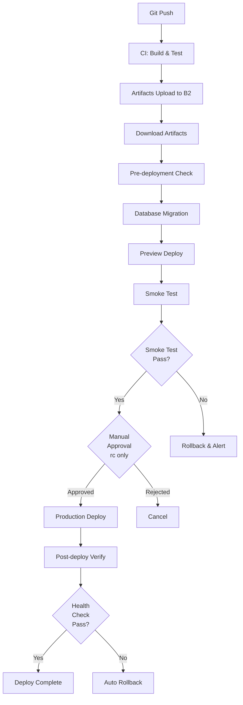

# デプロイメントフロー

## 概要

このドキュメントは、CircleCIを使用した完全自動化デプロイメントフローについて説明します。

## デプロイメントアーキテクチャ



## デプロイフロー詳細

### Phase 1: ビルド & テスト

```bash
setup → format → lint → typecheck → test → e2e → build → upload-artifacts
```

### Phase 2: デプロイ準備（全環境共通）

#### 1. Download Artifacts

Backblaze B2から最新ビルドアーティファクトをダウンロード。

#### 2. Pre-deployment Check

デプロイ前の検証:
- ビルドアーティファクトの存在確認
- 環境変数の検証
- 設定ファイルの整合性チェック

#### 3. Database Migration

Prismaマイグレーションを自動実行:

```bash
cd packages/db
bunx prisma migrate status  # 状態確認
bunx prisma migrate deploy  # マイグレーション適用
```

**特徴**:
- 失敗時は自動でGitHub Issue作成
- ロールバック手順をIssueに記載

#### 4. Preview Deploy (Blue-Green準備)

Preview環境にデプロイ（本番トラフィックに影響なし）:

```bash
bun run deploy -- --env=preview
```

#### 5. Smoke Test

Preview環境で基本動作を検証:
- ヘルスチェックエンドポイント確認
- 重要なAPIの動作確認

### Phase 3: 本番デプロイ

#### RC環境（手動承認あり）

```
smoke-test → hold-approval → deploy → verify
```

- スモークテスト成功後、手動承認待ち
- 承認後に本番デプロイ実行

#### STG/PRD環境（完全自動）

```
smoke-test → deploy → verify
```

- スモークテスト成功で自動的に本番デプロイ
- デプロイ後のヘルスチェックで検証

## 環境別デプロイスケジュール

| 環境 | トリガー | 頻度 | 承認 |
| ---- | -------- | ---- | ---- |
| RC | Git Push (master) | 即時 | 手動承認 |
| STG | スケジュール | 毎日 0:00 JST | 自動 |
| PRD | スケジュール | 毎日 12:00 JST | 自動 |

## セーフティ機能

### 1. 自動ロールバック

デプロイ後のヘルスチェック失敗時に自動ロールバック:

```bash
wrangler pages deployment rollback --project-name portfolio-web
```

### 2. リトライロジック

デプロイ失敗時は最大3回自動リトライ:

```bash
MAX_RETRIES=3
RETRY_DELAY=10s
```

### 3. GitHub Issue自動作成

失敗時に自動的にIssue作成:
- マイグレーション失敗
- スモークテスト失敗
- デプロイ失敗

Issue内容:
- 失敗したジョブ
- 環境
- コミットSHA
- ロールバック手順

## ロールバック手順

### 手動ロールバック

```bash
# Cloudflare Pages
wrangler pages deployment rollback --project-name portfolio-web

# Cloudflare Workers
wrangler rollback --name api

# データベース
cd packages/db
bunx prisma migrate resolve --rolled-back <migration-name>
```

### CircleCI経由でのロールバック

```bash
# 特定のコミットSHAのアーティファクトを再デプロイ
circleci trigger deploy --param commit_sha=<previous-commit-sha>
```

## モニタリング & アラート

### デプロイメトリクス

- デプロイ頻度: 毎日（STG: 0:00, PRD: 12:00）
- 成功率: CircleCI UIで確認
- MTTR: GitHub Issuesで追跡

### アラート先

- **GitHub Issues**: 自動作成（全失敗）
- **Grafana**: メトリクス監視
- **Sentry**: エラー追跡

## ベストプラクティス

### デプロイ前

1. ローカルで全テスト実行: `bun run test && bun run e2e`
2. 型チェック: `bun run typecheck`
3. リント: `bun run lint`

### デプロイ中

1. CircleCI UIでログ監視
2. Grafanaでメトリクス確認
3. Sentryでエラー監視

### デプロイ後

1. ヘルスチェック確認
2. 主要機能の動作確認
3. ログで異常がないか確認

## トラブルシューティング

### マイグレーション失敗

1. CircleCI UIでログ確認
2. DATABASE_URL環境変数を確認
3. 手動でマイグレーション状態確認:
   ```bash
   cd packages/db
   bunx prisma migrate status
   ```

### スモークテスト失敗

1. Preview URLにアクセスして動作確認
2. Cloudflare Dashboardでログ確認
3. Sentryでエラー確認

### デプロイ失敗

1. CircleCI UIでログ確認
2. Cloudflare APIトークンの権限確認
3. ビルドアーティファクトの存在確認

## 参考資料

- [CircleCI Documentation](https://circleci.com/docs/)
- [Cloudflare Pages Deployment](https://developers.cloudflare.com/pages/)
- [Prisma Migrations](https://www.prisma.io/docs/concepts/components/prisma-migrate)
- [トラブルシューティングガイド](../development/troubleshooting.md)
