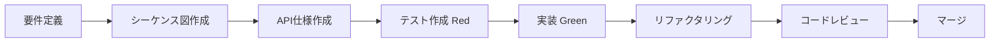

## 1. 新機能開発（SDD + TDD）



1. `docs/user-stories/` にユーザーストーリーを作成
2. `docs/sequence/` にシーケンス図を作成
3. `docs/specs/api/` にAPI仕様を作成
4. テストを先に作成（Red）
5. 最小限の実装（Green）
6. リファクタリング
7. PRを作成してレビュー

## 2. バグ修正

1. バグを再現するテストを追加
2. テストが失敗することを確認
3. バグを修正
4. テストが通過することを確認
5. PRを作成

## 3. コード品質チェック

```bash
# 全チェックを実行
bun run check

# 自動修正
bun run lint:fix
bun run fmt
```
