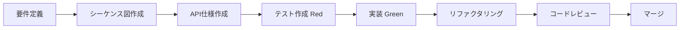

> 仕様駆動開発 (SDD) + テスト駆動開発 (TDD) を採用したMonorepoプロジェクト

## Quick Start

### 開発環境のセットアップ

```bash
# 1. リポジトリをクローン
git clone https://github.com/ageha734/portfolio.git
cd portfolio

# 2. 依存関係をインストール
bun install

# 3. 開発サーバーを起動
bun run dev
```

### 頻出コマンド

| コマンド | 説明 |
| -------- | ---- |
| `bun run dev` | 開発サーバー起動（全アプリ） |
| `bun run test` | ユニットテスト実行 |
| `bun run lint` | リント実行 |
| `bun run typecheck` | 型チェック実行 |
| `bun run integration` | E2Eテスト実行 |
| `bun run e2e` | E2Eテスト実行 |
| `bun run build` | プロダクションビルド |

## Tech Stack

### アプリケーション

| アプリ | 技術スタック | 説明 |
| ------ | ------------ | ---- |
| **apps/web** | Remix + Cloudflare Pages | ポートフォリオサイト（FSD） |
| **apps/admin** | TanStack Router + Vite | 管理ダッシュボード（FSD） |
| **apps/api** | Hono + Cloudflare Workers | バックエンドAPI（DDD） |
| **apps/e2e** | Remix + Cloudflare Pages | Test Portal - 認証付きテストレポート |
| **apps/wiki** | Astro + Starlight | ドキュメントサイト |

### 共有パッケージ

| パッケージ | 説明 |
| ---------- | ---- |
| `@portfolio/db` | Prisma + D1/TiDB データベース |
| `@portfolio/api` | API クライアント（Orval生成） |
| `@portfolio/auth` | Better Auth 認証 |
| `@portfolio/ui` | 共通UIコンポーネント |
| `@portfolio/validation` | Zodバリデーションスキーマ |
| `@portfolio/log` | 構造化ロギング・エラー処理 |

### インフラストラクチャ

| サービス | 用途 |
| -------- | ---- |
| Cloudflare Pages | Webホスティング |
| Cloudflare Workers | APIサーバー |
| Backblaze | オブジェクトストレージ |
| TiDB Cloud | データベース |
| Redis Cloud | キャッシュ |

## Documentation Map

### 設計・仕様

| カテゴリ | 説明 | パス |
| -------- | ---- | ---- |
| [アーキテクチャ](./architecture/overview.md) | システム全体の設計 | `docs/architecture/` |
| [API仕様](./specs/api/) | REST API仕様書 | `docs/specs/api/` |
| [DB仕様](./specs/db/) | データベーススキーマ | `docs/specs/db/` |
| [シーケンス図](./sequence/) | 処理フロー図 | `docs/sequence/` |
| [ユーザーストーリー](./user-stories/) | BDDユーザーストーリー | `docs/user-stories/` |

### 開発ガイド

| カテゴリ | 説明 | パス |
| -------- | ---- | ---- |
| [コーディング規約](./development/coding-standards.md) | 命名規則・スタイル | `docs/development/` |
| [テスト戦略](./development/testing.md) | テスト方針・実行方法 | `docs/development/testing.md` |
| [環境変数](./development/environment-variables.md) | 環境設定 | `docs/development/environment-variables.md` |
| [デプロイ](./development/deployment.md) | CI/CD・デプロイ手順 | `docs/development/deployment.md` |

### 品質・セキュリティ

| カテゴリ | 説明 | パス |
| -------- | ---- | ---- |
| [セキュリティ](./security/) | セキュリティガイドライン | `docs/security/` |
| [バリデーション](./specs/validation.md) | 入力検証仕様 | `docs/specs/validation.md` |
| [エラーコード](./specs/error-codes.md) | エラー定義一覧 | `docs/specs/error-codes.md` |
| [QAシート](./testing/qa-sheet.md) | テストカバレッジ | `docs/testing/qa-sheet.md` |

### レイヤー構造

#### Frontend (FSD - Feature-Sliced Design)

```text
app/
├── routes/      # ページコンポーネント
├── widgets/     # 大きなUIブロック
├── features/    # ユーザー機能
├── entities/    # ドメインモデル
└── shared/      # 共通リソース
```

#### Backend (DDD - Domain-Driven Design)

```text
src/
├── interface/       # REST API層
│   ├── rest/        # ルートハンドラ
│   └── middleware/  # ミドルウェア
├── application/     # アプリケーション層
│   └── usecases/    # ユースケース
├── domain/          # ドメイン層
│   └── entities/    # エンティティ
└── infrastructure/  # インフラ層
    └── repositories/ # リポジトリ
```

## Development Workflow

### 1. 新機能開発（SDD + TDD）



1. `docs/user-stories/` にユーザーストーリーを作成
2. `docs/sequence/` にシーケンス図を作成
3. `docs/specs/api/` にAPI仕様を作成
4. テストを先に作成（Red）
5. 最小限の実装（Green）
6. リファクタリング
7. PRを作成してレビュー

### 2. バグ修正

1. バグを再現するテストを追加
2. テストが失敗することを確認
3. バグを修正
4. テストが通過することを確認
5. PRを作成

### 3. コード品質チェック

```bash
# 全チェックを実行
bun run lint && bun run typecheck && bun run test

# 自動修正
bun run lint:fix
bun run fmt
```

## Testing Strategy

### Google Test Sizes

| サイズ | 説明 | 実行時間 | 命名規則 |
| ------ | ---- | -------- | -------- |
| **Small** | ユニットテスト（モック使用） | < 100ms | `*.test.ts` |
| **Medium** | 統合テスト（DB使用） | < 1s | `*.integration.test.ts` |
| **Large** | E2Eテスト（ブラウザ使用） | < 10s | `*.spec.ts` |

### テストとドキュメントの対応

| テストタイプ | 対応ドキュメント |
| ------------ | ---------------- |
| Small Tests | コード内JSDoc |
| Medium Tests | `docs/sequence/api/` シーケンス図 |
| Large Tests | `docs/user-stories/` ユーザーストーリー |

### カバレッジ目標

| メトリクス | 目標 |
| ---------- | ---- |
| Lines | 90% |
| Functions | 90% |
| Statements | 90% |
| Branches | 100% |

## Project Structure

```text
portfolio/
├── apps/
│   ├── web/                 # ポートフォリオサイト (Remix)
│   ├── admin/               # 管理画面 (TanStack Router)
│   ├── api/                 # バックエンドAPI (Hono)
│   ├── e2e/                 # Test Portal - 認証付きテストレポート (Remix)
│   └── wiki/                # ドキュメントサイト (Astro)
├── packages/
│   ├── db/                  # データベース (Prisma)
│   ├── api/                 # APIクライアント (Orval)
│   ├── auth/                # 認証 (Better Auth)
│   ├── ui/                  # UIコンポーネント
│   ├── validation/          # バリデーション (Zod)
│   └── log/                 # ロギング・エラー処理
├── tooling/
│   ├── typescript/          # TypeScript設定
│   └── vitest/              # Vitest設定
├── docs/                    # ドキュメント
│   ├── architecture/        # アーキテクチャ
│   ├── development/         # 開発ガイド
│   ├── sequence/            # シーケンス図
│   ├── specs/               # API/DB仕様
│   ├── user-stories/        # ユーザーストーリー
│   ├── security/            # セキュリティ
│   └── testing/             # テストドキュメント
├── .claude/                 # Claude Code設定
│   ├── agents/              # AIエージェント定義
│   ├── skills/              # スキル定義
│   ├── rules/               # ルール定義
│   └── templates/           # テンプレート
└── .docker/                 # Docker設定
    └── e2e/                 # E2Eテスト用
```

## Important Rules

### 禁止事項

| 項目 | 禁止内容 | 理由 |
| ---- | -------- | ---- |
| ディレクトリ名 | `utils/` | 曖昧な名前は禁止。`lib/`, `shared/`, `infra/` を使用 |
| エディタ | `vim`, `nano`, `emacs` | シェルがフリーズする |
| Git | `git push --force` | 破壊的操作 |
| コード | 認証情報のハードコード | セキュリティリスク |

### 命名規則

| 要素 | 規則 | 例 |
| ---- | ---- | -- |
| ファイル名 | ケバブケース | `user-service.ts` |
| クラス名 | パスカルケース | `UserService` |
| 関数名 | キャメルケース | `getUserById` |
| 定数 | アッパースネークケース | `MAX_RETRY_COUNT` |
| テストファイル | `*.test.ts` / `*.spec.ts` | `user-service.test.ts` |

### コミットメッセージ

Types: feat, fix, docs, style, refactor, test, chore
Scope: admin, api, e2e, web, wiki

```text
{type}({scope}): {subject}
```

## Support

### 質問・フィードバック

- Claude Code: `/help` コマンドで使い方を確認

### 参考資料

| リソース | リンク |
| -------- | ------ |
| Feature-Sliced Design | [feature-sliced.design](https://feature-sliced.design/) |
| Domain-Driven Design | [domainlanguage.com](https://www.domainlanguage.com/ddd/) |
| Turborepo | [turbo.build/repo](https://turbo.build/repo/docs) |
| Bun | [bun.sh](https://bun.sh/docs) |
| Cloudflare Workers | [developers.cloudflare.com](https://developers.cloudflare.com/workers/) |
| Hono | [hono.dev](https://hono.dev/) |
| Remix | [remix.run](https://remix.run/docs) |
| TanStack Router | [tanstack.com/router](https://tanstack.com/router) |
