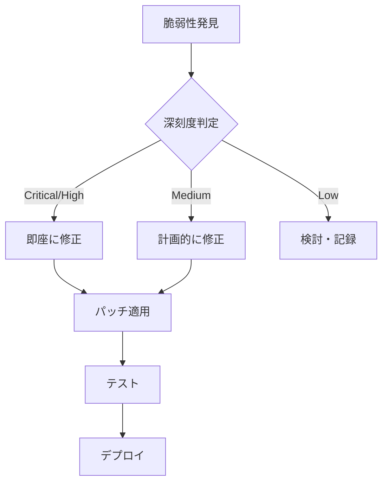

## 概要

このドキュメントは、プロジェクトのセキュリティ基準と実装ガイドラインを定義します。

## セキュリティ原則

### 1. 多層防御 (Defense in Depth)

単一のセキュリティ対策に依存せず、複数の層でセキュリティを確保する。

```text
┌─────────────────────────────────────────┐
│           ネットワーク層                 │
│  ┌─────────────────────────────────┐    │
│  │       アプリケーション層         │    │
│  │  ┌─────────────────────────┐    │    │
│  │  │       データ層           │    │    │
│  │  │  ┌─────────────────┐    │    │    │
│  │  │  │   バリデーション   │    │    │    │
│  │  │  └─────────────────┘    │    │    │
│  │  └─────────────────────────┘    │    │
│  └─────────────────────────────────┘    │
└─────────────────────────────────────────┘
```

### 2. 最小権限の原則

- ユーザー/サービスに必要最小限の権限のみを付与
- 権限昇格を防止

### 3. セキュアバイデフォルト

- デフォルト設定を安全な状態に
- 機能を明示的に有効化する設計

## 認証・認可

### 認証 (Authentication)

Better Auth では、セッションの有効期限・更新間隔、レート制限（ウィンドウ・最大リクエスト数）、パスワードの最小長・大文字・小文字・数字・記号の必須を設定する。  
実装は `packages/auth/src/` を参照。

#### セッション管理

| 項目 | 設定値 | 理由 |
| ---- | ------ | ---- |
| セッション有効期限 | 24時間 | セキュリティとUXのバランス |
| セッション更新間隔 | 1時間 | セッションハイジャック防止 |
| 同時セッション数 | 5 | 不正アクセス検出 |

### 認可 (Authorization)

ロール（admin / editor / viewer）ごとに permissions 配列で read, write, delete, manage を定義する。  
認可チェックでは、コンテキストから user を取得し、未認証なら AUTH_UNAUTHORIZED、要求権限が user.permissions に含まれなければ AUTH_FORBIDDEN を返す。  
実装は `packages/auth/src/roles.ts` と `apps/api` の認可ミドルウェアを参照。

## 入力検証

### バリデーション原則

1. **すべての入力を検証**: クライアント側とサーバー側の両方で検証
2. **ホワイトリスト方式**: 許可する値を明示的に定義
3. **型と範囲の検証**: データ型、長さ、範囲を検証

Zod でユーザー入力スキーマを定義する。  
email は形式・最大長、password は最小12文字と大文字・小文字・数字・記号の各 regex、name は長さと危険な特殊文字の除外を行う。  
実装は `packages/validation/` を参照。

### SQLインジェクション対策

クエリは文字列結合せず、Prisma の where や D1 の prepare/bind などパラメータ化クエリ・プリペアドステートメントを用いる。  
実装例はリポジトリの DB アクセス層を参照。

### XSS対策

ユーザー入力を HTML として出力する前に DOMPurify でサニタイズする。  
許可タグ・許可属性を制限して設定する。  
実装は各アプリの `shared/lib/sanitize` を参照。

## データ保護

### 機密データの暗号化

| データ種別 | 保存時 | 転送時 |
| ---------- | ------ | ------ |
| パスワード | bcryptハッシュ | HTTPS |
| APIキー | 暗号化 | HTTPS |
| セッション | 署名付き | HTTPS |
| 個人情報 | 暗号化 | HTTPS |

### シークレット管理

```bash
# ❌ 危険: ハードコード
const API_KEY = "sk_live_1234567890";

# ✅ 安全: 環境変数
const API_KEY = process.env.API_KEY;

# ✅ 安全: Cloudflareシークレット
# Cloudflare環境変数は env.yaml から設定、または bun run で実行
# （詳細は scripts/command-addition-list.md の TODO 参照）
```

### .gitignoreの必須項目

`.env` 系、`*.pem` / `*.key` / credentials、`*.log`、ローカル DB ファイル（`*.db` / `*.sqlite`）を .gitignore に含め、リポジトリにコミットしない。  
詳細はルートの .gitignore を参照。

## セキュリティヘッダー

X-Content-Type-Options（nosniff）、X-Frame-Options（DENY）、X-XSS-Protection、Content-Security-Policy、Strict-Transport-Security、Referrer-Policy をミドルウェアで設定する。  
実装は `apps/api` の security-headers ミドルウェアを参照。

### CORS設定

許可オリジンを本番ドメインと開発時の localhost に限定し、credentials・allowMethods・allowHeaders・maxAge を設定する。  
実装は `apps/api` の CORS 設定を参照。

## レート制限

### エンドポイント別設定

| エンドポイント | 制限 | 理由 |
| -------------- | ---- | ---- |
| 認証 | 10 req/分 | ブルートフォース防止 |
| API一般 | 100 req/分 | DDoS防止 |
| 検索 | 30 req/分 | リソース保護 |
| アップロード | 10 req/分 | 帯域保護 |

認証用と API 一般用で windowMs と limit を分けたレートリミッターを hono-rate-limiter 等で設定する。  
実装は `apps/api` の rate-limit ミドルウェアを参照。

## ログとモニタリング

### ログ出力ルール

| イベント | ログレベル | 含めるべき情報 |
| -------- | ---------- | -------------- |
| 認証成功 | INFO | ユーザーID, IP, タイムスタンプ |
| 認証失敗 | WARN | IP, 試行回数, タイムスタンプ |
| 認可エラー | WARN | ユーザーID, リソース, 要求権限 |
| セキュリティエラー | ERROR | 詳細情報, スタックトレース |

### 含めてはいけない情報

- パスワード（平文・ハッシュ両方）
- APIキー・シークレット
- セッショントークン
- 個人識別情報（PII）

ログ出力前に、password / token / secret / apiKey / authorization 等のキーを持つ値を [REDACTED] に置き換えるサニタイズ処理を行う。  
実装は `packages/log/` を参照。

## 脆弱性管理

週次で `bun audit`、デプロイ前に `trivy fs --severity HIGH,CRITICAL .`、コミット前に `gitleaks detect` を実行する。  
詳細は package.json および CI を参照。

### 脆弱性対応フロー



## インシデント対応

### 対応手順

1. **検出**: モニタリングアラート or 報告
2. **封じ込め**: 影響範囲の特定と隔離
3. **根絶**: 原因の特定と除去
4. **復旧**: サービスの復旧
5. **振り返り**: 再発防止策の策定

## 関連ドキュメント

- [OWASP チェックリスト](./owasp-checklist.md)
- [エラーコード仕様](../specs/error-codes.md)
- [環境変数管理](../development/environment-variables.md)
