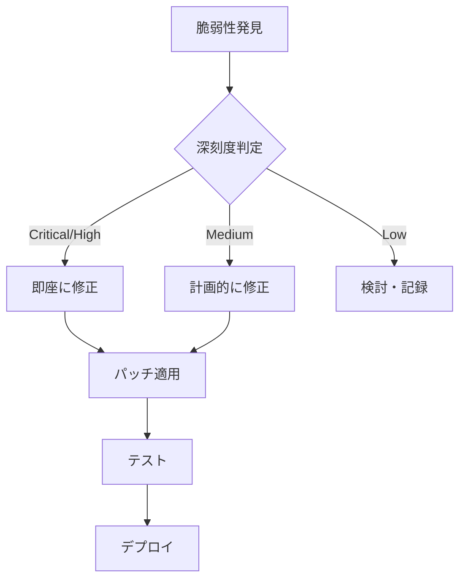

# セキュリティガイドライン

## 概要

このドキュメントは、プロジェクトのセキュリティ基準と実装ガイドラインを定義します。

## セキュリティ原則

### 1. 多層防御 (Defense in Depth)

単一のセキュリティ対策に依存せず、複数の層でセキュリティを確保する。

```text
┌─────────────────────────────────────────┐
│           ネットワーク層                 │
│  ┌─────────────────────────────────┐    │
│  │       アプリケーション層         │    │
│  │  ┌─────────────────────────┐    │    │
│  │  │       データ層           │    │    │
│  │  │  ┌─────────────────┐    │    │    │
│  │  │  │   バリデーション   │    │    │    │
│  │  │  └─────────────────┘    │    │    │
│  │  └─────────────────────────┘    │    │
│  └─────────────────────────────────┘    │
└─────────────────────────────────────────┘
```

### 2. 最小権限の原則

- ユーザー/サービスに必要最小限の権限のみを付与
- 権限昇格を防止

### 3. セキュアバイデフォルト

- デフォルト設定を安全な状態に
- 機能を明示的に有効化する設計

## 認証・認可

### 認証 (Authentication)

#### Better Auth設定

```typescript
// packages/auth/src/config.ts
import { betterAuth } from "better-auth";

export const auth = betterAuth({
    // セッション設定
    session: {
        expiresIn: 60 * 60 * 24, // 24時間
        updateAge: 60 * 60,      // 1時間ごとに更新
    },

    // セキュリティ設定
    rateLimit: {
        windowMs: 15 * 60 * 1000, // 15分
        max: 100,                  // 最大リクエスト数
    },

    // パスワードポリシー
    password: {
        minLength: 12,
        requireUppercase: true,
        requireLowercase: true,
        requireNumbers: true,
        requireSymbols: true,
    },
});
```

#### セッション管理

| 項目 | 設定値 | 理由 |
| ---- | ------ | ---- |
| セッション有効期限 | 24時間 | セキュリティとUXのバランス |
| セッション更新間隔 | 1時間 | セッションハイジャック防止 |
| 同時セッション数 | 5 | 不正アクセス検出 |

### 認可 (Authorization)

#### ロールベースアクセス制御 (RBAC)

```typescript
// packages/auth/src/roles.ts
export const roles = {
    admin: {
        permissions: ["read", "write", "delete", "manage"],
    },
    editor: {
        permissions: ["read", "write"],
    },
    viewer: {
        permissions: ["read"],
    },
} as const;
```

#### 認可チェックパターン

```typescript
// apps/api/src/interface/middleware/authorization.ts
import { AppError, ErrorCodes } from "@portfolio/log";

export function requirePermission(permission: string) {
    return async (c: Context, next: Next) => {
        const user = c.get("user");

        if (!user) {
            throw AppError.fromCode(ErrorCodes.AUTH_UNAUTHORIZED);
        }

        if (!user.permissions.includes(permission)) {
            throw AppError.fromCode(ErrorCodes.AUTH_FORBIDDEN);
        }

        await next();
    };
}
```

## 入力検証

### バリデーション原則

1. **すべての入力を検証**: クライアント側とサーバー側の両方で検証
2. **ホワイトリスト方式**: 許可する値を明示的に定義
3. **型と範囲の検証**: データ型、長さ、範囲を検証

### Zodによるスキーマ検証

```typescript
// packages/validation/src/schemas/user.ts
import { z } from "zod";

export const userInputSchema = z.object({
    email: z.string()
        .email("有効なメールアドレスを入力してください")
        .max(255),
    password: z.string()
        .min(12, "パスワードは12文字以上必要です")
        .regex(/[A-Z]/, "大文字を含める必要があります")
        .regex(/[a-z]/, "小文字を含める必要があります")
        .regex(/[0-9]/, "数字を含める必要があります")
        .regex(/[^A-Za-z0-9]/, "記号を含める必要があります"),
    name: z.string()
        .min(1)
        .max(100)
        .regex(/^[^<>\"'&]*$/, "特殊文字は使用できません"),
});
```

### SQLインジェクション対策

```typescript
// ❌ 危険: 文字列結合
const query = `SELECT * FROM users WHERE id = '${id}'`;

// ✅ 安全: パラメータ化クエリ (Prisma)
const user = await prisma.user.findUnique({
    where: { id },
});

// ✅ 安全: プリペアドステートメント (D1)
const result = await db.prepare(
    "SELECT * FROM users WHERE id = ?"
).bind(id).first();
```

### XSS対策

```typescript
// apps/web/app/shared/lib/sanitize.ts
import DOMPurify from "dompurify";

export function sanitizeHtml(dirty: string): string {
    return DOMPurify.sanitize(dirty, {
        ALLOWED_TAGS: ["p", "br", "strong", "em", "a", "ul", "ol", "li"],
        ALLOWED_ATTR: ["href", "target", "rel"],
    });
}

// 使用例
const safeHtml = sanitizeHtml(userInput);
```

## データ保護

### 機密データの暗号化

| データ種別 | 保存時 | 転送時 |
| ---------- | ------ | ------ |
| パスワード | bcryptハッシュ | HTTPS |
| APIキー | 暗号化 | HTTPS |
| セッション | 署名付き | HTTPS |
| 個人情報 | 暗号化 | HTTPS |

### シークレット管理

```bash
# ❌ 危険: ハードコード
const API_KEY = "sk_live_1234567890";

# ✅ 安全: 環境変数
const API_KEY = process.env.API_KEY;

# ✅ 安全: Cloudflareシークレット
wrangler secret put API_KEY
```

### .gitignoreの必須項目

```gitignore
# 環境変数
.env
.env.local
.env.*.local

# シークレット
*.pem
*.key
credentials.json

# ログ
*.log

# ローカルデータベース
*.db
*.sqlite
```

## セキュリティヘッダー

### HTTPヘッダー設定

```typescript
// apps/api/src/interface/middleware/security-headers.ts
export function securityHeaders() {
    return async (c: Context, next: Next) => {
        // XSS対策
        c.header("X-Content-Type-Options", "nosniff");
        c.header("X-Frame-Options", "DENY");
        c.header("X-XSS-Protection", "1; mode=block");

        // コンテンツセキュリティポリシー
        c.header(
            "Content-Security-Policy",
            "default-src 'self'; script-src 'self'; style-src 'self' 'unsafe-inline'"
        );

        // HTTPS強制
        c.header(
            "Strict-Transport-Security",
            "max-age=31536000; includeSubDomains"
        );

        // Referrer制御
        c.header("Referrer-Policy", "strict-origin-when-cross-origin");

        await next();
    };
}
```

### CORS設定

```typescript
// apps/api/src/config/cors.ts
export const corsConfig = {
    origin: (origin: string | undefined) => {
        const allowedOrigins = [
            "https://portfolio.example.com",
            "https://admin.portfolio.example.com",
        ];

        if (process.env.NODE_ENV === "development") {
            allowedOrigins.push("http://localhost:3000", "http://localhost:5173");
        }

        return allowedOrigins.includes(origin ?? "") ? origin : null;
    },
    credentials: true,
    allowMethods: ["GET", "POST", "PUT", "DELETE", "OPTIONS"],
    allowHeaders: ["Content-Type", "Authorization"],
    maxAge: 86400, // 24時間
};
```

## レート制限

### エンドポイント別設定

| エンドポイント | 制限 | 理由 |
| -------------- | ---- | ---- |
| 認証 | 10 req/分 | ブルートフォース防止 |
| API一般 | 100 req/分 | DDoS防止 |
| 検索 | 30 req/分 | リソース保護 |
| アップロード | 10 req/分 | 帯域保護 |

```typescript
// apps/api/src/interface/middleware/rate-limit.ts
import { rateLimiter } from "hono-rate-limiter";

export const authRateLimit = rateLimiter({
    windowMs: 60 * 1000,  // 1分
    limit: 10,
    message: { code: "RATE_LIMIT_EXCEEDED", message: "リクエスト数が制限を超えました" },
});

export const apiRateLimit = rateLimiter({
    windowMs: 60 * 1000,
    limit: 100,
});
```

## ログとモニタリング

### ログ出力ルール

| イベント | ログレベル | 含めるべき情報 |
| -------- | ---------- | -------------- |
| 認証成功 | INFO | ユーザーID, IP, タイムスタンプ |
| 認証失敗 | WARN | IP, 試行回数, タイムスタンプ |
| 認可エラー | WARN | ユーザーID, リソース, 要求権限 |
| セキュリティエラー | ERROR | 詳細情報, スタックトレース |

### 含めてはいけない情報

- パスワード（平文・ハッシュ両方）
- APIキー・シークレット
- セッショントークン
- 個人識別情報（PII）

```typescript
// packages/log/src/logger.ts
function sanitizeLogData(data: Record<string, unknown>): Record<string, unknown> {
    const sensitiveKeys = ["password", "token", "secret", "apiKey", "authorization"];
    const sanitized = { ...data };

    for (const key of Object.keys(sanitized)) {
        if (sensitiveKeys.some(k => key.toLowerCase().includes(k))) {
            sanitized[key] = "[REDACTED]";
        }
    }

    return sanitized;
}
```

## 脆弱性管理

### 定期的なセキュリティチェック

```bash
# 依存関係の脆弱性チェック（週次）
bun audit

# コンテナスキャン（デプロイ前）
trivy fs --severity HIGH,CRITICAL .

# シークレットスキャン（コミット前）
gitleaks detect --source . --verbose
```

### 脆弱性対応フロー



## インシデント対応

### 対応手順

1. **検出**: モニタリングアラート or 報告
2. **封じ込め**: 影響範囲の特定と隔離
3. **根絶**: 原因の特定と除去
4. **復旧**: サービスの復旧
5. **振り返り**: 再発防止策の策定

### 連絡先

| 役割 | 連絡先 |
| ---- | ------ |
| セキュリティ担当 | security@example.com |
| インシデント対応 | incident@example.com |

## 関連ドキュメント

- [OWASP チェックリスト](./owasp-checklist.md)
- [エラーコード仕様](../specs/error-codes.md)
- [環境変数管理](../development/environment-variables.md)
