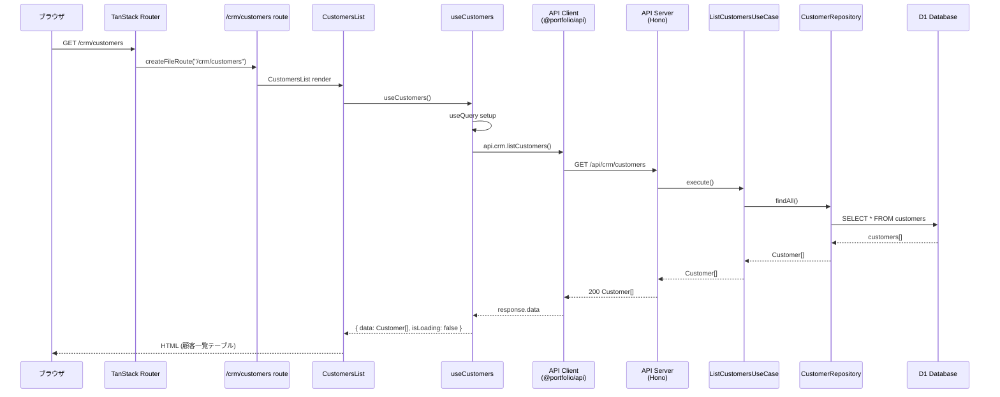

## Sequence Diagram

```mermaid
sequenceDiagram
    participant Browser as ブラウザ
    participant Router as TanStack Router
    participant Route as /crm/customers route
    participant Component as CustomersList
    participant Hook as useCustomers
    participant APIClient as API Client<br/>(@portfolio/api)
    participant API as API Server<br/>(Hono)
    participant UseCase as ListCustomersUseCase
    participant Repository as CustomerRepository
    participant DB as D1 Database

    Browser->>Router: GET /crm/customers
    Router->>Route: createFileRoute("/crm/customers")
    Route->>Component: CustomersList render
    Component->>Hook: useCustomers()
    Hook->>Hook: useQuery setup
    Hook->>APIClient: api.crm.listCustomers()
    APIClient->>API: GET /api/crm/customers
    API->>UseCase: execute()
    UseCase->>Repository: findAll()
    Repository->>DB: SELECT * FROM customers
    DB-->>Repository: customers[]
    Repository-->>UseCase: Customer[]
    UseCase-->>API: Customer[]
    API-->>APIClient: 200 Customer[]
    APIClient-->>Hook: response.data
    Hook-->>Component: { data: Customer[], isLoading: false }
    Component-->>Browser: HTML (顧客一覧テーブル)
```
