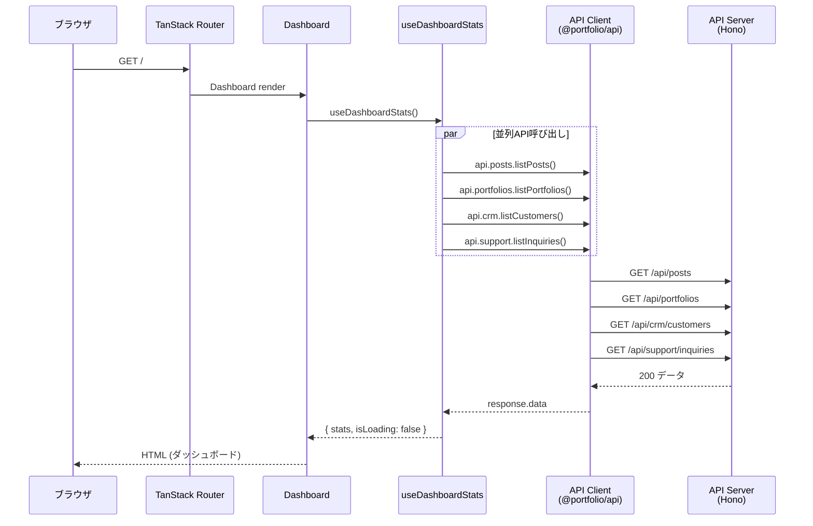

## Sequence Diagram

```mermaid
sequenceDiagram
    participant Browser as ブラウザ
    participant Router as TanStack Router
    participant Component as Dashboard
    participant Hook as useDashboardStats
    participant APIClient as API Client<br/>(@portfolio/api)
    participant API as API Server<br/>(Hono)

    Browser->>Router: GET /
    Router->>Component: Dashboard render
    Component->>Hook: useDashboardStats()

    par 並列API呼び出し
        Hook->>APIClient: api.posts.listPosts()
        Hook->>APIClient: api.portfolios.listPortfolios()
        Hook->>APIClient: api.crm.listCustomers()
        Hook->>APIClient: api.support.listInquiries()
    end

    APIClient->>API: GET /api/posts
    APIClient->>API: GET /api/portfolios
    APIClient->>API: GET /api/crm/customers
    APIClient->>API: GET /api/support/inquiries

    API-->>APIClient: 200 データ
    APIClient-->>Hook: response.data
    Hook-->>Component: { stats, isLoading: false }
    Component-->>Browser: HTML (ダッシュボード)
```
