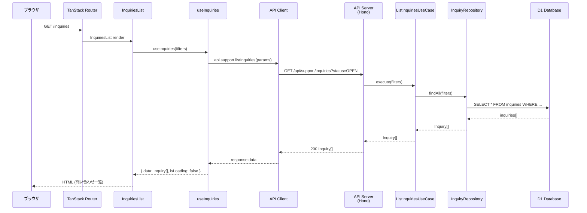

## Sequence Diagram

```mermaid
sequenceDiagram
    participant Browser as ブラウザ
    participant Router as TanStack Router
    participant Component as InquiriesList
    participant Hook as useInquiries
    participant APIClient as API Client
    participant API as API Server<br/>(Hono)
    participant UseCase as ListInquiriesUseCase
    participant Repository as InquiryRepository
    participant DB as D1 Database

    Browser->>Router: GET /inquiries
    Router->>Component: InquiriesList render
    Component->>Hook: useInquiries(filters)
    Hook->>APIClient: api.support.listInquiries(params)
    APIClient->>API: GET /api/support/inquiries?status=OPEN
    API->>UseCase: execute(filters)
    UseCase->>Repository: findAll(filters)
    Repository->>DB: SELECT * FROM inquiries WHERE ...
    DB-->>Repository: inquiries[]
    Repository-->>UseCase: Inquiry[]
    UseCase-->>API: Inquiry[]
    API-->>APIClient: 200 Inquiry[]
    APIClient-->>Hook: response.data
    Hook-->>Component: { data: Inquiry[], isLoading: false }
    Component-->>Browser: HTML (問い合わせ一覧)
```
