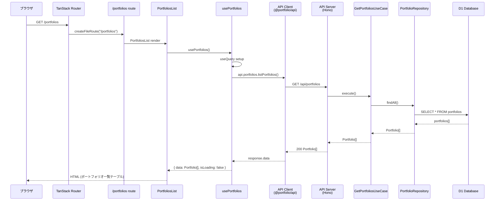

## Sequence Diagram

```mermaid
sequenceDiagram
    participant Browser as ブラウザ
    participant Router as TanStack Router
    participant Route as /portfolios route
    participant Component as PortfoliosList
    participant Hook as usePortfolios
    participant APIClient as API Client<br/>(@portfolio/api)
    participant API as API Server<br/>(Hono)
    participant UseCase as GetPortfoliosUseCase
    participant Repository as PortfolioRepository
    participant DB as D1 Database

    Browser->>Router: GET /portfolios
    Router->>Route: createFileRoute("/portfolios")
    Route->>Component: PortfoliosList render
    Component->>Hook: usePortfolios()
    Hook->>Hook: useQuery setup
    Hook->>APIClient: api.portfolios.listPortfolios()
    APIClient->>API: GET /api/portfolios
    API->>UseCase: execute()
    UseCase->>Repository: findAll()
    Repository->>DB: SELECT * FROM portfolios
    DB-->>Repository: portfolios[]
    Repository-->>UseCase: Portfolio[]
    UseCase-->>API: Portfolio[]
    API-->>APIClient: 200 Portfolio[]
    APIClient-->>Hook: response.data
    Hook-->>Component: { data: Portfolio[], isLoading: false }
    Component-->>Browser: HTML (ポートフォリオ一覧テーブル)
```
