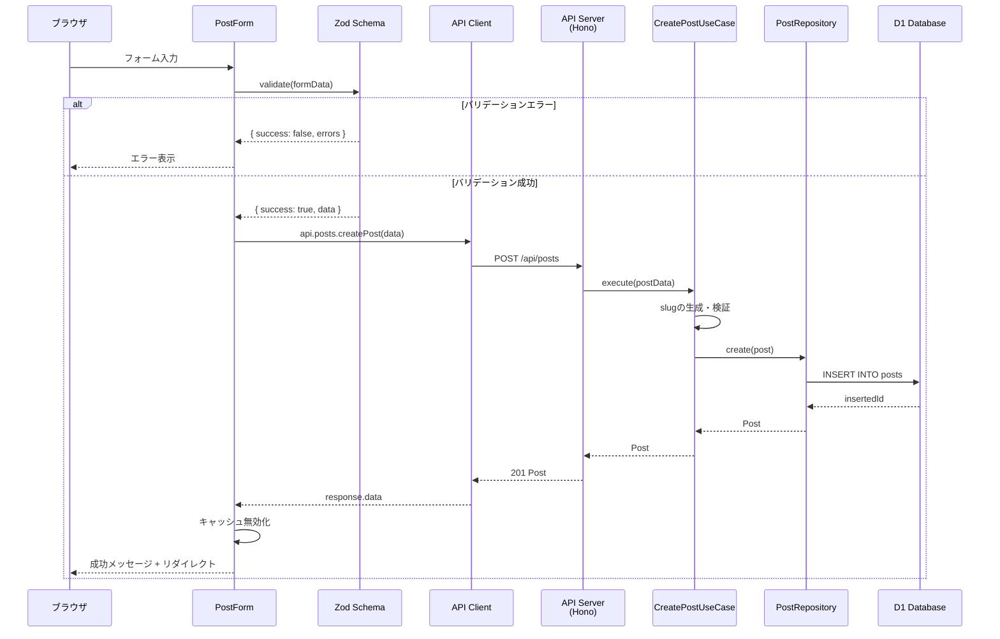

## Sequence Diagram

```mermaid
sequenceDiagram
    participant Browser as ブラウザ
    participant Component as PostForm
    participant Validation as Zod Schema
    participant APIClient as API Client
    participant API as API Server<br/>(Hono)
    participant UseCase as CreatePostUseCase
    participant Repository as PostRepository
    participant DB as D1 Database

    Browser->>Component: フォーム入力
    Component->>Validation: validate(formData)

    alt バリデーションエラー
        Validation-->>Component: { success: false, errors }
        Component-->>Browser: エラー表示
    else バリデーション成功
        Validation-->>Component: { success: true, data }
        Component->>APIClient: api.posts.createPost(data)
        APIClient->>API: POST /api/posts
        API->>UseCase: execute(postData)
        UseCase->>UseCase: slugの生成・検証
        UseCase->>Repository: create(post)
        Repository->>DB: INSERT INTO posts
        DB-->>Repository: insertedId
        Repository-->>UseCase: Post
        UseCase-->>API: Post
        API-->>APIClient: 201 Post
        APIClient-->>Component: response.data
        Component->>Component: キャッシュ無効化
        Component-->>Browser: 成功メッセージ + リダイレクト
    end
```
