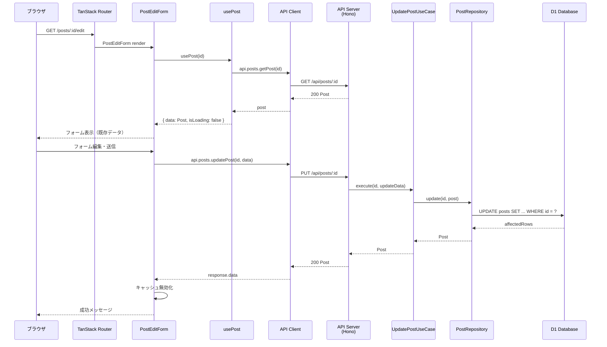

## Sequence Diagram

```mermaid
sequenceDiagram
    participant Browser as ブラウザ
    participant Router as TanStack Router
    participant Component as PostEditForm
    participant Hook as usePost
    participant APIClient as API Client
    participant API as API Server<br/>(Hono)
    participant UseCase as UpdatePostUseCase
    participant Repository as PostRepository
    participant DB as D1 Database

    Browser->>Router: GET /posts/:id/edit
    Router->>Component: PostEditForm render
    Component->>Hook: usePost(id)
    Hook->>APIClient: api.posts.getPost(id)
    APIClient->>API: GET /api/posts/:id
    API-->>APIClient: 200 Post
    APIClient-->>Hook: post
    Hook-->>Component: { data: Post, isLoading: false }
    Component-->>Browser: フォーム表示（既存データ）

    Browser->>Component: フォーム編集・送信
    Component->>APIClient: api.posts.updatePost(id, data)
    APIClient->>API: PUT /api/posts/:id
    API->>UseCase: execute(id, updateData)
    UseCase->>Repository: update(id, post)
    Repository->>DB: UPDATE posts SET ... WHERE id = ?
    DB-->>Repository: affectedRows
    Repository-->>UseCase: Post
    UseCase-->>API: Post
    API-->>APIClient: 200 Post
    APIClient-->>Component: response.data
    Component->>Component: キャッシュ無効化
    Component-->>Browser: 成功メッセージ
```
