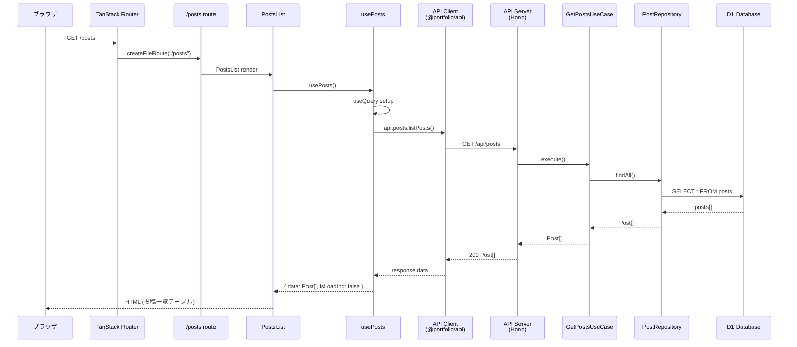

## Sequence Diagram

```mermaid
sequenceDiagram
    participant Browser as ブラウザ
    participant Router as TanStack Router
    participant Route as /posts route
    participant Component as PostsList
    participant Hook as usePosts
    participant APIClient as API Client<br/>(@portfolio/api)
    participant API as API Server<br/>(Hono)
    participant UseCase as GetPostsUseCase
    participant Repository as PostRepository
    participant DB as D1 Database

    Browser->>Router: GET /posts
    Router->>Route: createFileRoute("/posts")
    Route->>Component: PostsList render
    Component->>Hook: usePosts()
    Hook->>Hook: useQuery setup
    Hook->>APIClient: api.posts.listPosts()
    APIClient->>API: GET /api/posts
    API->>UseCase: execute()
    UseCase->>Repository: findAll()
    Repository->>DB: SELECT * FROM posts
    DB-->>Repository: posts[]
    Repository-->>UseCase: Post[]
    UseCase-->>API: Post[]
    API-->>APIClient: 200 Post[]
    APIClient-->>Hook: response.data
    Hook-->>Component: { data: Post[], isLoading: false }
    Component-->>Browser: HTML (投稿一覧テーブル)
```
