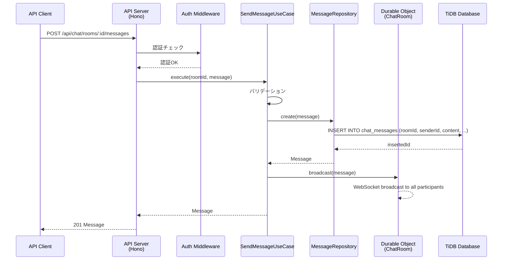

## Sequence Diagram

```mermaid
sequenceDiagram
    participant Client as API Client
    participant API as API Server<br/>(Hono)
    participant Auth as Auth Middleware
    participant UseCase as SendMessageUseCase
    participant Repository as MessageRepository
    participant DO as Durable Object<br/>(ChatRoom)
    participant DB as TiDB Database

    Client->>API: POST /api/chat/rooms/:id/messages
    API->>Auth: 認証チェック
    Auth-->>API: 認証OK

    API->>UseCase: execute(roomId, message)
    UseCase->>UseCase: バリデーション
    UseCase->>Repository: create(message)
    Repository->>DB: INSERT INTO chat_messages (roomId, senderId, content, ...)
    DB-->>Repository: insertedId
    Repository-->>UseCase: Message

    UseCase->>DO: broadcast(message)
    DO-->>DO: WebSocket broadcast to all participants

    UseCase-->>API: Message
    API-->>Client: 201 Message
```
