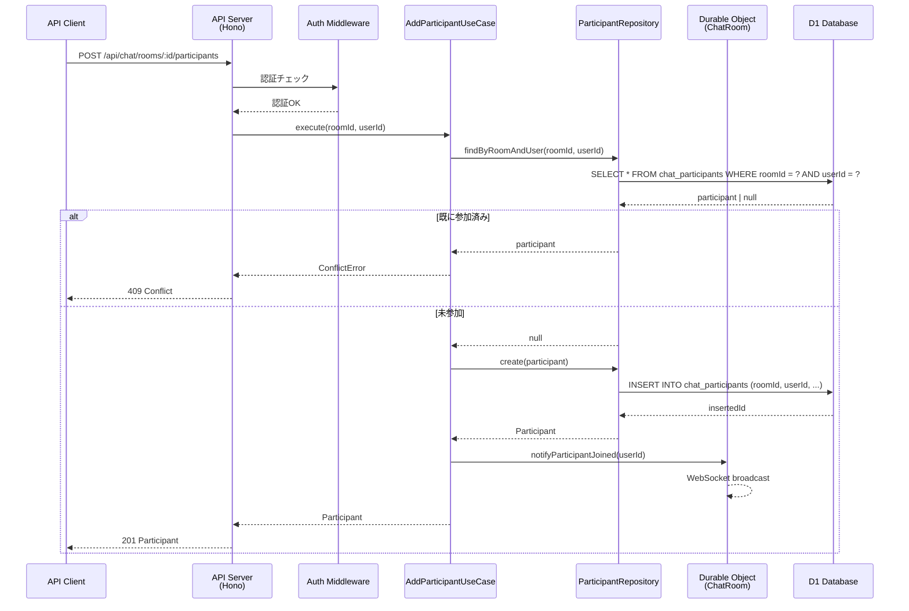

## Sequence Diagram

```mermaid
sequenceDiagram
    participant Client as API Client
    participant API as API Server<br/>(Hono)
    participant Auth as Auth Middleware
    participant UseCase as AddParticipantUseCase
    participant Repository as ParticipantRepository
    participant DO as Durable Object<br/>(ChatRoom)
    participant DB as D1 Database

    Client->>API: POST /api/chat/rooms/:id/participants
    API->>Auth: 認証チェック
    Auth-->>API: 認証OK

    API->>UseCase: execute(roomId, userId)
    UseCase->>Repository: findByRoomAndUser(roomId, userId)
    Repository->>DB: SELECT * FROM chat_participants WHERE roomId = ? AND userId = ?
    DB-->>Repository: participant | null

    alt 既に参加済み
        Repository-->>UseCase: participant
        UseCase-->>API: ConflictError
        API-->>Client: 409 Conflict
    else 未参加
        Repository-->>UseCase: null
        UseCase->>Repository: create(participant)
        Repository->>DB: INSERT INTO chat_participants (roomId, userId, ...)
        DB-->>Repository: insertedId
        Repository-->>UseCase: Participant

        UseCase->>DO: notifyParticipantJoined(userId)
        DO-->>DO: WebSocket broadcast

        UseCase-->>API: Participant
        API-->>Client: 201 Participant
    end
```
