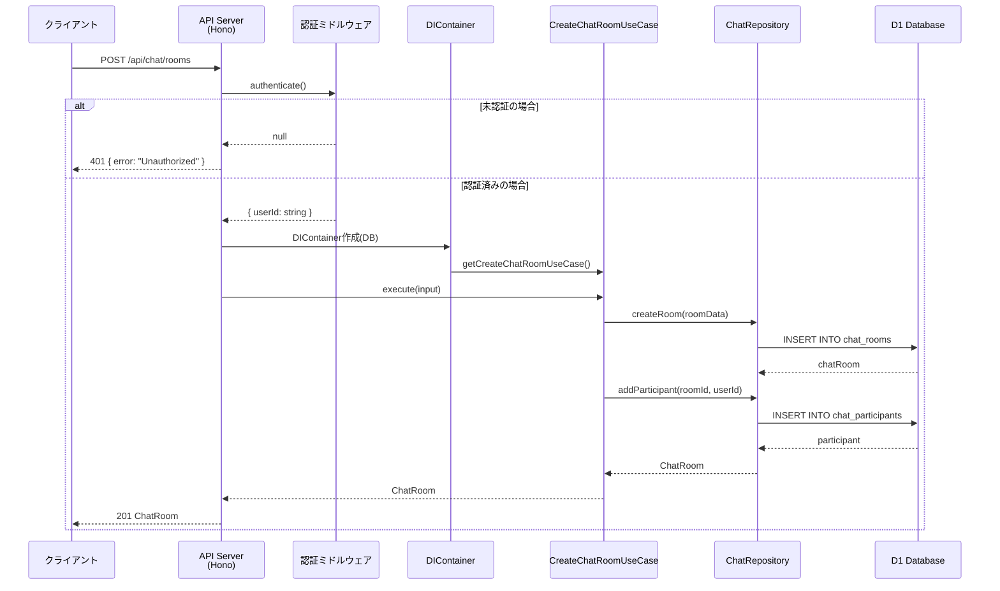

## Sequence Diagram

```mermaid
sequenceDiagram
    participant Client as クライアント
    participant API as API Server<br/>(Hono)
    participant Auth as 認証ミドルウェア
    participant Container as DIContainer
    participant UseCase as CreateChatRoomUseCase
    participant Repository as ChatRepository
    participant DB as D1 Database

    Client->>API: POST /api/chat/rooms
    API->>Auth: authenticate()
    alt 未認証の場合
        Auth-->>API: null
        API-->>Client: 401 { error: "Unauthorized" }
    else 認証済みの場合
        Auth-->>API: { userId: string }
        API->>Container: DIContainer作成(DB)
        Container->>UseCase: getCreateChatRoomUseCase()
        API->>UseCase: execute(input)
        UseCase->>Repository: createRoom(roomData)
        Repository->>DB: INSERT INTO chat_rooms
        DB-->>Repository: chatRoom
        UseCase->>Repository: addParticipant(roomId, userId)
        Repository->>DB: INSERT INTO chat_participants
        DB-->>Repository: participant
        Repository-->>UseCase: ChatRoom
        UseCase-->>API: ChatRoom
        API-->>Client: 201 ChatRoom
    end
```
