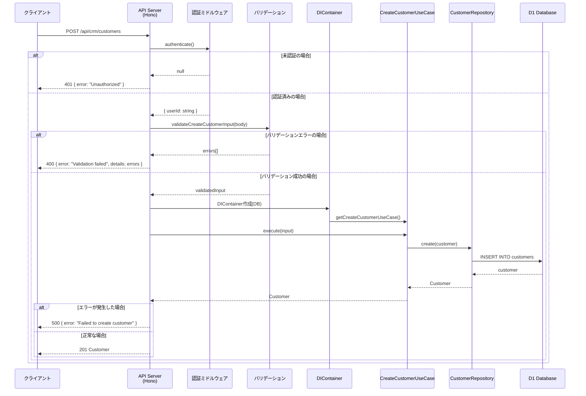

## Sequence Diagram

```mermaid
sequenceDiagram
    participant Client as クライアント
    participant API as API Server<br/>(Hono)
    participant Auth as 認証ミドルウェア
    participant Validation as バリデーション
    participant Container as DIContainer
    participant UseCase as CreateCustomerUseCase
    participant Repository as CustomerRepository
    participant DB as D1 Database

    Client->>API: POST /api/crm/customers
    API->>Auth: authenticate()
    alt 未認証の場合
        Auth-->>API: null
        API-->>Client: 401 { error: "Unauthorized" }
    else 認証済みの場合
        Auth-->>API: { userId: string }
        API->>Validation: validateCreateCustomerInput(body)
        alt バリデーションエラーの場合
            Validation-->>API: errors[]
            API-->>Client: 400 { error: "Validation failed", details: errors }
        else バリデーション成功の場合
            Validation-->>API: validatedInput
            API->>Container: DIContainer作成(DB)
            Container->>UseCase: getCreateCustomerUseCase()
            API->>UseCase: execute(input)
            UseCase->>Repository: create(customer)
            Repository->>DB: INSERT INTO customers
            DB-->>Repository: customer
            Repository-->>UseCase: Customer
            UseCase-->>API: Customer
            alt エラーが発生した場合
                API-->>Client: 500 { error: "Failed to create customer" }
            else 正常な場合
                API-->>Client: 201 Customer
            end
        end
    end
```
