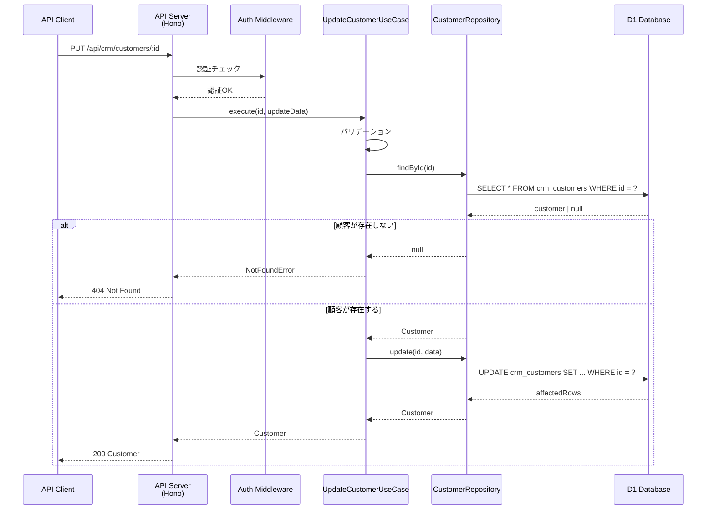

## Sequence Diagram

```mermaid
sequenceDiagram
    participant Client as API Client
    participant API as API Server<br/>(Hono)
    participant Auth as Auth Middleware
    participant UseCase as UpdateCustomerUseCase
    participant Repository as CustomerRepository
    participant DB as D1 Database

    Client->>API: PUT /api/crm/customers/:id
    API->>Auth: 認証チェック
    Auth-->>API: 認証OK

    API->>UseCase: execute(id, updateData)
    UseCase->>UseCase: バリデーション
    UseCase->>Repository: findById(id)
    Repository->>DB: SELECT * FROM crm_customers WHERE id = ?
    DB-->>Repository: customer | null

    alt 顧客が存在しない
        Repository-->>UseCase: null
        UseCase-->>API: NotFoundError
        API-->>Client: 404 Not Found
    else 顧客が存在する
        Repository-->>UseCase: Customer
        UseCase->>Repository: update(id, data)
        Repository->>DB: UPDATE crm_customers SET ... WHERE id = ?
        DB-->>Repository: affectedRows
        Repository-->>UseCase: Customer
        UseCase-->>API: Customer
        API-->>Client: 200 Customer
    end
```
