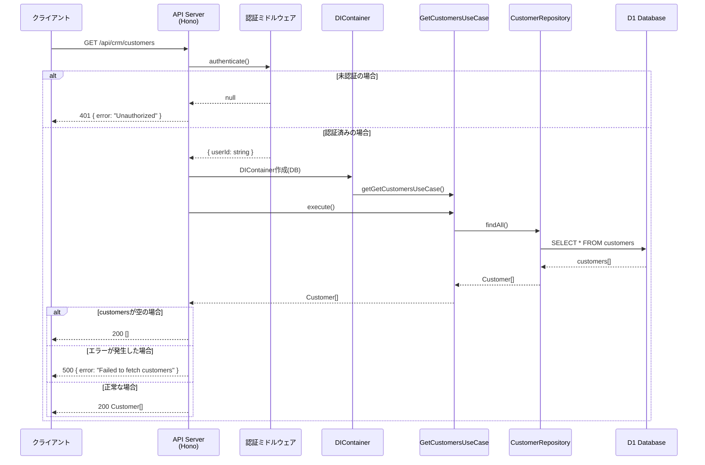

## Sequence Diagram



## エンドポイント仕様

### リクエスト

- **Method**: GET
- **Path**: `/api/crm/customers`
- **認証**: 必要

### レスポンス

| ステータス | 説明 | ボディ |
|-----------|------|--------|
| 200 | 成功 | `Customer[]` |
| 401 | 未認証 | `{ error: "Unauthorized" }` |
| 500 | サーバーエラー | `{ error: "Failed to fetch customers" }` |

### Customer オブジェクト

```typescript
interface Customer {
    id: string;
    name: string;
    email?: string;
    phone?: string;
    company?: string;
    website?: string;
    address?: string;
    notes?: string;
    status: "ACTIVE" | "INACTIVE" | "PROSPECT" | "CHURNED";
    tags?: string[];
    createdAt: string;
    updatedAt: string;
}
```
