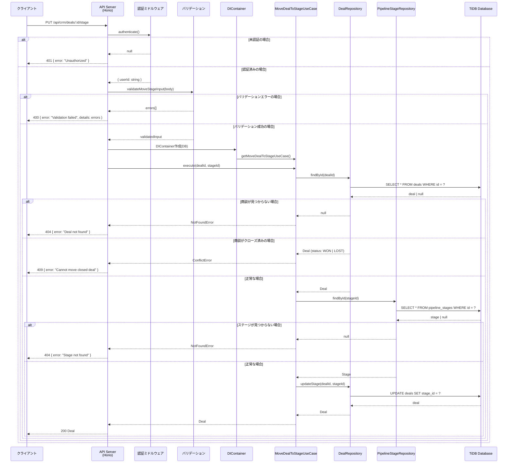

## Sequence Diagram

```mermaid
sequenceDiagram
    participant Client as クライアント
    participant API as API Server<br/>(Hono)
    participant Auth as 認証ミドルウェア
    participant Validation as バリデーション
    participant Container as DIContainer
    participant UseCase as MoveDealToStageUseCase
    participant DealRepo as DealRepository
    participant StageRepo as PipelineStageRepository
    participant DB as TiDB Database

    Client->>API: PUT /api/crm/deals/:id/stage
    API->>Auth: authenticate()
    alt 未認証の場合
        Auth-->>API: null
        API-->>Client: 401 { error: "Unauthorized" }
    else 認証済みの場合
        Auth-->>API: { userId: string }
        API->>Validation: validateMoveStageInput(body)
        alt バリデーションエラーの場合
            Validation-->>API: errors[]
            API-->>Client: 400 { error: "Validation failed", details: errors }
        else バリデーション成功の場合
            Validation-->>API: validatedInput
            API->>Container: DIContainer作成(DB)
            Container->>UseCase: getMoveDealToStageUseCase()
            API->>UseCase: execute(dealId, stageId)
            UseCase->>DealRepo: findById(dealId)
            DealRepo->>DB: SELECT * FROM deals WHERE id = ?
            DB-->>DealRepo: deal | null
            alt 商談が見つからない場合
                DealRepo-->>UseCase: null
                UseCase-->>API: NotFoundError
                API-->>Client: 404 { error: "Deal not found" }
            else 商談がクローズ済みの場合
                DealRepo-->>UseCase: Deal (status: WON | LOST)
                UseCase-->>API: ConflictError
                API-->>Client: 409 { error: "Cannot move closed deal" }
            else 正常な場合
                DealRepo-->>UseCase: Deal
                UseCase->>StageRepo: findById(stageId)
                StageRepo->>DB: SELECT * FROM pipeline_stages WHERE id = ?
                DB-->>StageRepo: stage | null
                alt ステージが見つからない場合
                    StageRepo-->>UseCase: null
                    UseCase-->>API: NotFoundError
                    API-->>Client: 404 { error: "Stage not found" }
                else 正常な場合
                    StageRepo-->>UseCase: Stage
                    UseCase->>DealRepo: updateStage(dealId, stageId)
                    DealRepo->>DB: UPDATE deals SET stage_id = ?
                    DB-->>DealRepo: deal
                    DealRepo-->>UseCase: Deal
                    UseCase-->>API: Deal
                    API-->>Client: 200 Deal
                end
            end
        end
    end
```
