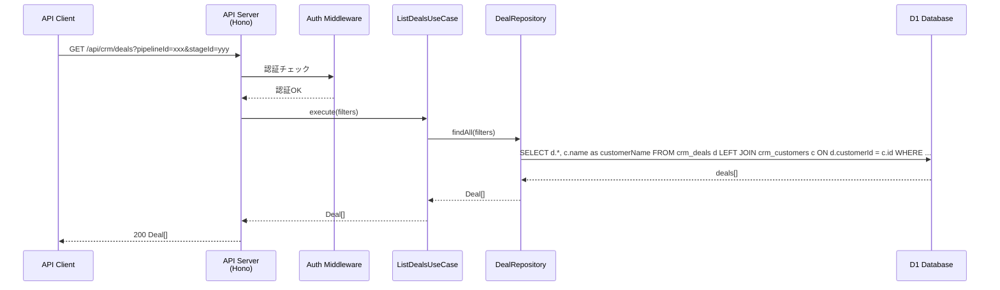

## Sequence Diagram

```mermaid
sequenceDiagram
    participant Client as API Client
    participant API as API Server<br/>(Hono)
    participant Auth as Auth Middleware
    participant UseCase as ListDealsUseCase
    participant Repository as DealRepository
    participant DB as D1 Database

    Client->>API: GET /api/crm/deals?pipelineId=xxx&stageId=yyy
    API->>Auth: 認証チェック
    Auth-->>API: 認証OK

    API->>UseCase: execute(filters)
    UseCase->>Repository: findAll(filters)
    Repository->>DB: SELECT d.*, c.name as customerName FROM crm_deals d LEFT JOIN crm_customers c ON d.customerId = c.id WHERE ...
    DB-->>Repository: deals[]
    Repository-->>UseCase: Deal[]
    UseCase-->>API: Deal[]
    API-->>Client: 200 Deal[]
```
