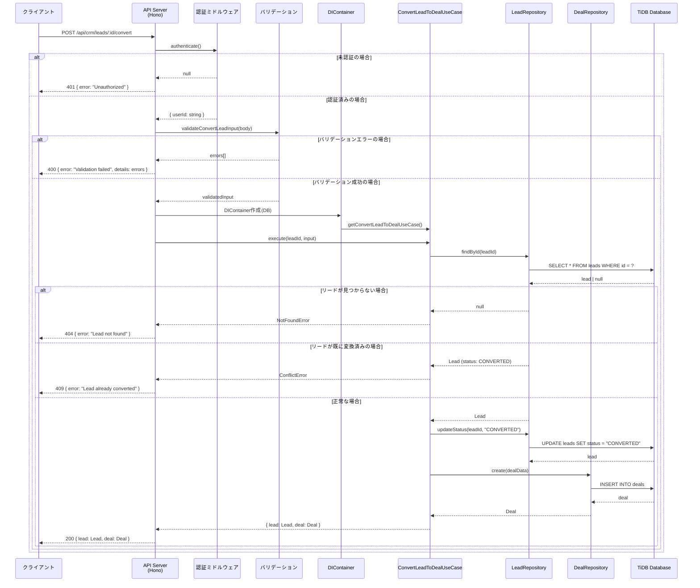

## Sequence Diagram

```mermaid
sequenceDiagram
    participant Client as クライアント
    participant API as API Server<br/>(Hono)
    participant Auth as 認証ミドルウェア
    participant Validation as バリデーション
    participant Container as DIContainer
    participant UseCase as ConvertLeadToDealUseCase
    participant LeadRepo as LeadRepository
    participant DealRepo as DealRepository
    participant DB as TiDB Database

    Client->>API: POST /api/crm/leads/:id/convert
    API->>Auth: authenticate()
    alt 未認証の場合
        Auth-->>API: null
        API-->>Client: 401 { error: "Unauthorized" }
    else 認証済みの場合
        Auth-->>API: { userId: string }
        API->>Validation: validateConvertLeadInput(body)
        alt バリデーションエラーの場合
            Validation-->>API: errors[]
            API-->>Client: 400 { error: "Validation failed", details: errors }
        else バリデーション成功の場合
            Validation-->>API: validatedInput
            API->>Container: DIContainer作成(DB)
            Container->>UseCase: getConvertLeadToDealUseCase()
            API->>UseCase: execute(leadId, input)
            UseCase->>LeadRepo: findById(leadId)
            LeadRepo->>DB: SELECT * FROM leads WHERE id = ?
            DB-->>LeadRepo: lead | null
            alt リードが見つからない場合
                LeadRepo-->>UseCase: null
                UseCase-->>API: NotFoundError
                API-->>Client: 404 { error: "Lead not found" }
            else リードが既に変換済みの場合
                LeadRepo-->>UseCase: Lead (status: CONVERTED)
                UseCase-->>API: ConflictError
                API-->>Client: 409 { error: "Lead already converted" }
            else 正常な場合
                LeadRepo-->>UseCase: Lead
                UseCase->>LeadRepo: updateStatus(leadId, "CONVERTED")
                LeadRepo->>DB: UPDATE leads SET status = "CONVERTED"
                DB-->>LeadRepo: lead
                UseCase->>DealRepo: create(dealData)
                DealRepo->>DB: INSERT INTO deals
                DB-->>DealRepo: deal
                DealRepo-->>UseCase: Deal
                UseCase-->>API: { lead: Lead, deal: Deal }
                API-->>Client: 200 { lead: Lead, deal: Deal }
            end
        end
    end
```
