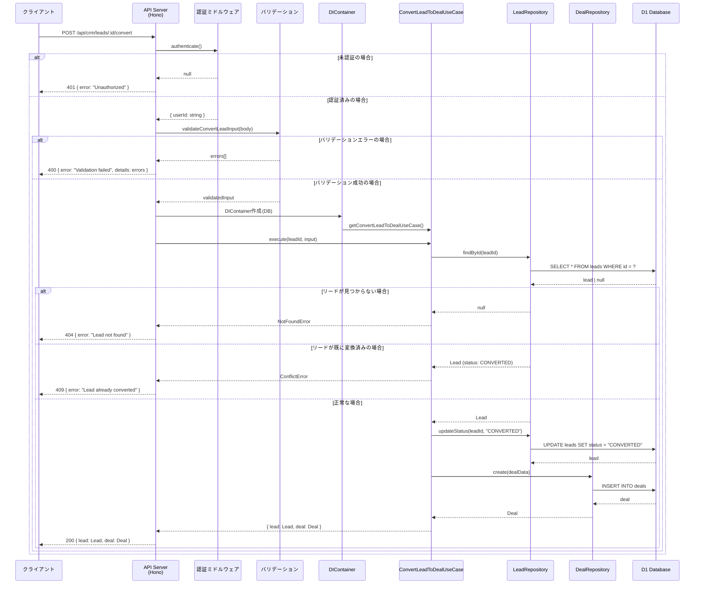

## Sequence Diagram



## エンドポイント仕様

### リクエスト

- **Method**: POST
- **Path**: `/api/crm/leads/:id/convert`
- **認証**: 必要
- **Content-Type**: `application/json`

### パスパラメータ

| パラメータ | 型 | 説明 |
|-----------|-----|------|
| id | string | リードID |

### リクエストボディ

```typescript
interface ConvertLeadInput {
    stageId: string;           // 必須: 商談の初期ステージID
    dealName?: string;         // オプション: 商談名（デフォルト: リード名）
    value?: number;            // オプション: 商談金額
    expectedCloseDate?: string; // オプション: 予定クローズ日
}
```

### レスポンス

| ステータス | 説明 | ボディ |
|-----------|------|--------|
| 200 | 変換成功 | `{ lead: Lead, deal: Deal }` |
| 400 | バリデーションエラー | `{ error: "Validation failed", details: [] }` |
| 401 | 未認証 | `{ error: "Unauthorized" }` |
| 404 | リードが見つからない | `{ error: "Lead not found" }` |
| 409 | 既に変換済み | `{ error: "Lead already converted" }` |
| 500 | サーバーエラー | `{ error: "Failed to convert lead" }` |

## ビジネスルール

1. リードのステータスが `CONVERTED` の場合、再度変換できない
2. 変換時にリードのステータスを `CONVERTED` に更新
3. 変換時に `convertedAt` タイムスタンプを設定
4. 新しい商談はリードの `customerId` を継承
