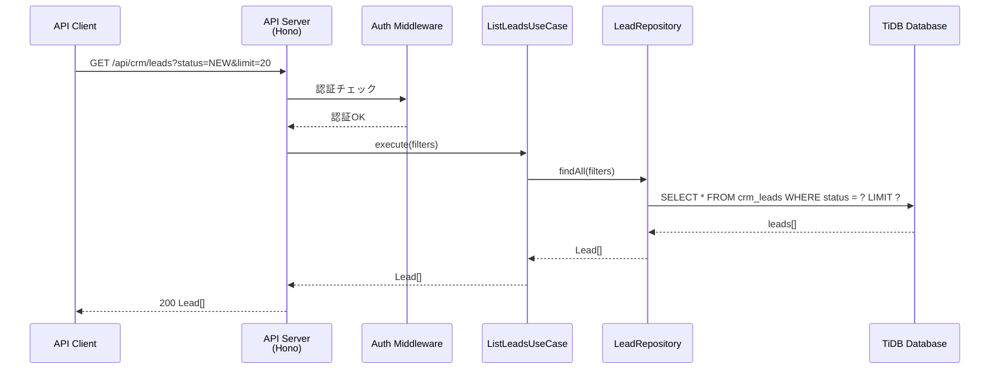

## Sequence Diagram

```mermaid
sequenceDiagram
    participant Client as API Client
    participant API as API Server<br/>(Hono)
    participant Auth as Auth Middleware
    participant UseCase as ListLeadsUseCase
    participant Repository as LeadRepository
    participant DB as TiDB Database

    Client->>API: GET /api/crm/leads?status=NEW&limit=20
    API->>Auth: 認証チェック
    Auth-->>API: 認証OK

    API->>UseCase: execute(filters)
    UseCase->>Repository: findAll(filters)
    Repository->>DB: SELECT * FROM crm_leads WHERE status = ? LIMIT ?
    DB-->>Repository: leads[]
    Repository-->>UseCase: Lead[]
    UseCase-->>API: Lead[]
    API-->>Client: 200 Lead[]
```
