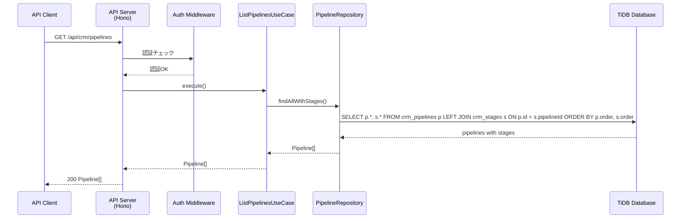

## Sequence Diagram

```mermaid
sequenceDiagram
    participant Client as API Client
    participant API as API Server<br/>(Hono)
    participant Auth as Auth Middleware
    participant UseCase as ListPipelinesUseCase
    participant Repository as PipelineRepository
    participant DB as TiDB Database

    Client->>API: GET /api/crm/pipelines
    API->>Auth: 認証チェック
    Auth-->>API: 認証OK

    API->>UseCase: execute()
    UseCase->>Repository: findAllWithStages()
    Repository->>DB: SELECT p.*, s.* FROM crm_pipelines p LEFT JOIN crm_stages s ON p.id = s.pipelineId ORDER BY p.order, s.order
    DB-->>Repository: pipelines with stages
    Repository-->>UseCase: Pipeline[]
    UseCase-->>API: Pipeline[]
    API-->>Client: 200 Pipeline[]
```
