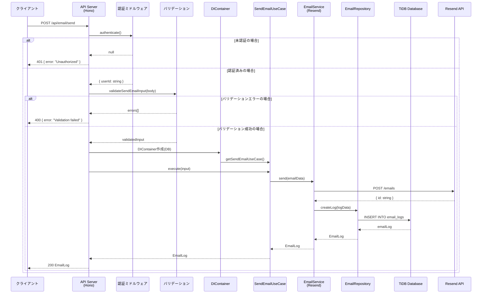

## Sequence Diagram

```mermaid
sequenceDiagram
    participant Client as クライアント
    participant API as API Server<br/>(Hono)
    participant Auth as 認証ミドルウェア
    participant Validation as バリデーション
    participant Container as DIContainer
    participant UseCase as SendEmailUseCase
    participant Service as EmailService<br/>(Resend)
    participant Repository as EmailRepository
    participant DB as TiDB Database
    participant Resend as Resend API

    Client->>API: POST /api/email/send
    API->>Auth: authenticate()
    alt 未認証の場合
        Auth-->>API: null
        API-->>Client: 401 { error: "Unauthorized" }
    else 認証済みの場合
        Auth-->>API: { userId: string }
        API->>Validation: validateSendEmailInput(body)
        alt バリデーションエラーの場合
            Validation-->>API: errors[]
            API-->>Client: 400 { error: "Validation failed" }
        else バリデーション成功の場合
            Validation-->>API: validatedInput
            API->>Container: DIContainer作成(DB)
            Container->>UseCase: getSendEmailUseCase()
            API->>UseCase: execute(input)
            UseCase->>Service: send(emailData)
            Service->>Resend: POST /emails
            Resend-->>Service: { id: string }
            Service->>Repository: createLog(logData)
            Repository->>DB: INSERT INTO email_logs
            DB-->>Repository: emailLog
            Repository-->>Service: EmailLog
            Service-->>UseCase: EmailLog
            UseCase-->>API: EmailLog
            API-->>Client: 200 EmailLog
        end
    end
```
