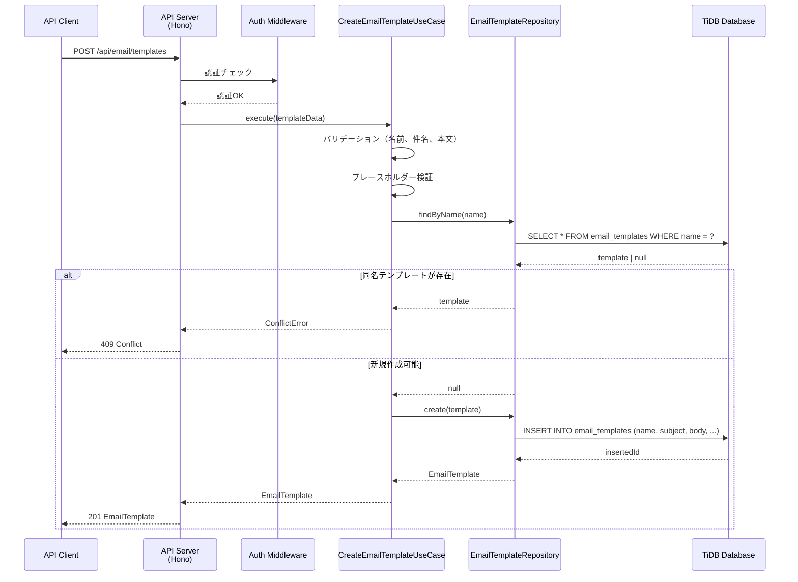

## Sequence Diagram

```mermaid
sequenceDiagram
    participant Client as API Client
    participant API as API Server<br/>(Hono)
    participant Auth as Auth Middleware
    participant UseCase as CreateEmailTemplateUseCase
    participant Repository as EmailTemplateRepository
    participant DB as TiDB Database

    Client->>API: POST /api/email/templates
    API->>Auth: 認証チェック
    Auth-->>API: 認証OK

    API->>UseCase: execute(templateData)
    UseCase->>UseCase: バリデーション（名前、件名、本文）
    UseCase->>UseCase: プレースホルダー検証

    UseCase->>Repository: findByName(name)
    Repository->>DB: SELECT * FROM email_templates WHERE name = ?
    DB-->>Repository: template | null

    alt 同名テンプレートが存在
        Repository-->>UseCase: template
        UseCase-->>API: ConflictError
        API-->>Client: 409 Conflict
    else 新規作成可能
        Repository-->>UseCase: null
        UseCase->>Repository: create(template)
        Repository->>DB: INSERT INTO email_templates (name, subject, body, ...)
        DB-->>Repository: insertedId
        Repository-->>UseCase: EmailTemplate
        UseCase-->>API: EmailTemplate
        API-->>Client: 201 EmailTemplate
    end
```
