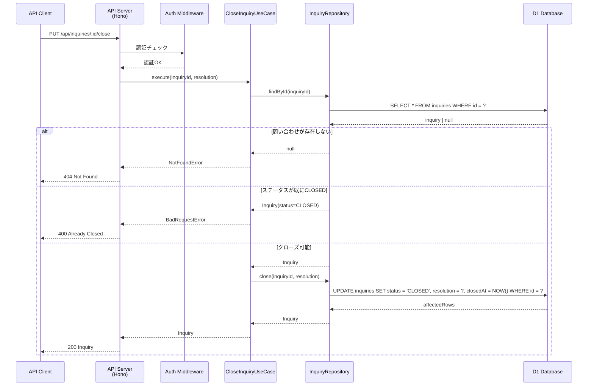

## Sequence Diagram

```mermaid
sequenceDiagram
    participant Client as API Client
    participant API as API Server<br/>(Hono)
    participant Auth as Auth Middleware
    participant UseCase as CloseInquiryUseCase
    participant Repository as InquiryRepository
    participant DB as D1 Database

    Client->>API: PUT /api/inquiries/:id/close
    API->>Auth: 認証チェック
    Auth-->>API: 認証OK

    API->>UseCase: execute(inquiryId, resolution)
    UseCase->>Repository: findById(inquiryId)
    Repository->>DB: SELECT * FROM inquiries WHERE id = ?
    DB-->>Repository: inquiry | null

    alt 問い合わせが存在しない
        Repository-->>UseCase: null
        UseCase-->>API: NotFoundError
        API-->>Client: 404 Not Found
    else ステータスが既にCLOSED
        Repository-->>UseCase: Inquiry(status=CLOSED)
        UseCase-->>API: BadRequestError
        API-->>Client: 400 Already Closed
    else クローズ可能
        Repository-->>UseCase: Inquiry
        UseCase->>Repository: close(inquiryId, resolution)
        Repository->>DB: UPDATE inquiries SET status = 'CLOSED', resolution = ?, closedAt = NOW() WHERE id = ?
        DB-->>Repository: affectedRows
        Repository-->>UseCase: Inquiry
        UseCase-->>API: Inquiry
        API-->>Client: 200 Inquiry
    end
```
