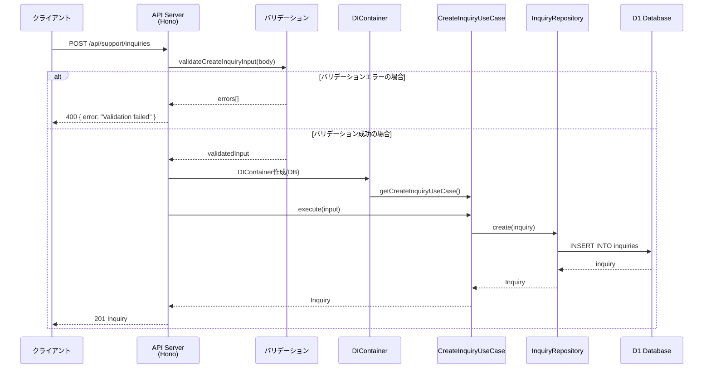

## Sequence Diagram

```mermaid
sequenceDiagram
    participant Client as クライアント
    participant API as API Server<br/>(Hono)
    participant Validation as バリデーション
    participant Container as DIContainer
    participant UseCase as CreateInquiryUseCase
    participant Repository as InquiryRepository
    participant DB as D1 Database

    Client->>API: POST /api/support/inquiries
    API->>Validation: validateCreateInquiryInput(body)
    alt バリデーションエラーの場合
        Validation-->>API: errors[]
        API-->>Client: 400 { error: "Validation failed" }
    else バリデーション成功の場合
        Validation-->>API: validatedInput
        API->>Container: DIContainer作成(DB)
        Container->>UseCase: getCreateInquiryUseCase()
        API->>UseCase: execute(input)
        UseCase->>Repository: create(inquiry)
        Repository->>DB: INSERT INTO inquiries
        DB-->>Repository: inquiry
        Repository-->>UseCase: Inquiry
        UseCase-->>API: Inquiry
        API-->>Client: 201 Inquiry
    end
```
