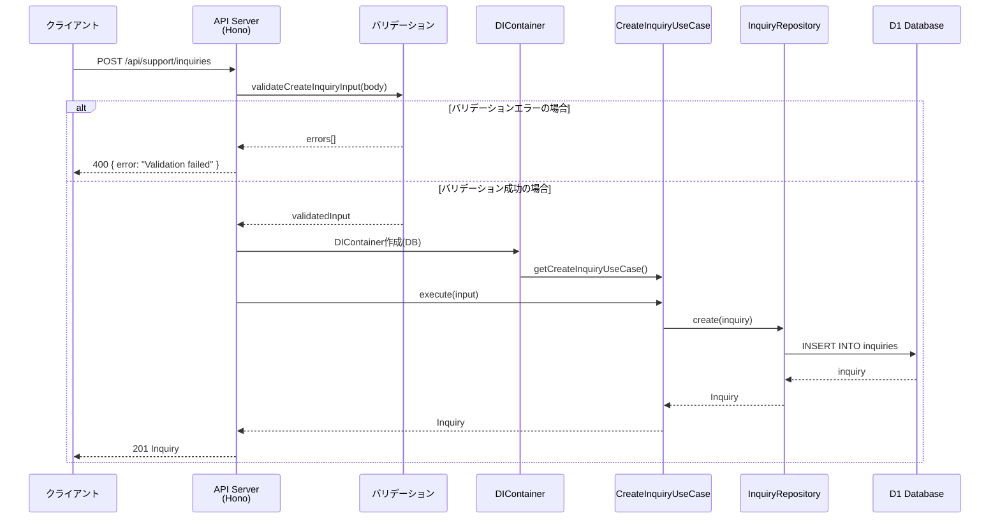

## Sequence Diagram



## エンドポイント仕様

### リクエスト

- **Method**: POST
- **Path**: `/api/support/inquiries`
- **認証**: オプション（顧客からの問い合わせは認証不要）

### リクエストボディ

```typescript
interface CreateInquiryInput {
    subject: string;        // 件名（必須）
    content: string;        // 内容（必須）
    customerId?: string;    // 顧客ID（オプション）
    category?: InquiryCategory; // カテゴリ（デフォルト: GENERAL）
    priority?: InquiryPriority; // 優先度（デフォルト: MEDIUM）
    source?: string;        // 流入元（web, email, chat等）
}

type InquiryCategory = "GENERAL" | "TECHNICAL" | "BILLING" | "SALES" | "COMPLAINT" | "FEATURE_REQUEST" | "OTHER";
type InquiryPriority = "LOW" | "MEDIUM" | "HIGH" | "URGENT";
```

### レスポンス

| ステータス | 説明 | ボディ |
|-----------|------|--------|
| 201 | 作成成功 | `Inquiry` |
| 400 | バリデーションエラー | `{ error: "Validation failed" }` |
| 500 | サーバーエラー | `{ error: "Failed to create inquiry" }` |
