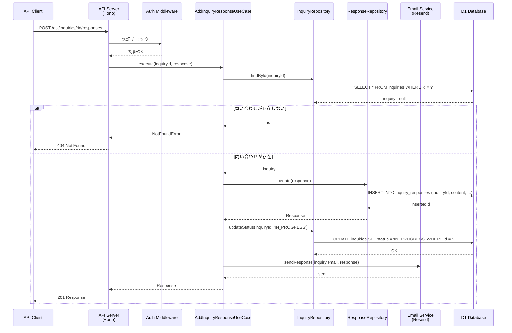

## Sequence Diagram

```mermaid
sequenceDiagram
    participant Client as API Client
    participant API as API Server<br/>(Hono)
    participant Auth as Auth Middleware
    participant UseCase as AddInquiryResponseUseCase
    participant InquiryRepo as InquiryRepository
    participant ResponseRepo as ResponseRepository
    participant EmailService as Email Service<br/>(Resend)
    participant DB as D1 Database

    Client->>API: POST /api/inquiries/:id/responses
    API->>Auth: 認証チェック
    Auth-->>API: 認証OK

    API->>UseCase: execute(inquiryId, response)
    UseCase->>InquiryRepo: findById(inquiryId)
    InquiryRepo->>DB: SELECT * FROM inquiries WHERE id = ?
    DB-->>InquiryRepo: inquiry | null

    alt 問い合わせが存在しない
        InquiryRepo-->>UseCase: null
        UseCase-->>API: NotFoundError
        API-->>Client: 404 Not Found
    else 問い合わせが存在
        InquiryRepo-->>UseCase: Inquiry
        UseCase->>ResponseRepo: create(response)
        ResponseRepo->>DB: INSERT INTO inquiry_responses (inquiryId, content, ...)
        DB-->>ResponseRepo: insertedId
        ResponseRepo-->>UseCase: Response

        UseCase->>InquiryRepo: updateStatus(inquiryId, 'IN_PROGRESS')
        InquiryRepo->>DB: UPDATE inquiries SET status = 'IN_PROGRESS' WHERE id = ?
        DB-->>InquiryRepo: OK

        UseCase->>EmailService: sendResponse(inquiry.email, response)
        EmailService-->>UseCase: sent

        UseCase-->>API: Response
        API-->>Client: 201 Response
    end
```
