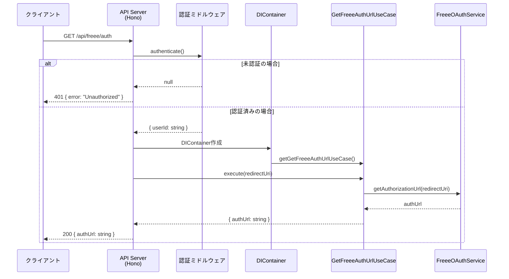
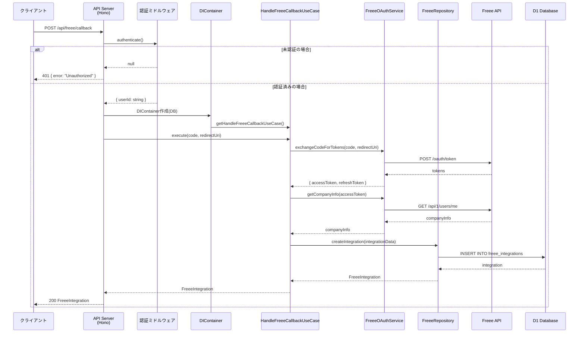

## Sequence Diagram

## エンドポイント仕様

### リクエスト

- **Method**: GET
- **Path**: `/api/freee/auth`
- **認証**: 必要

### クエリパラメータ

| パラメータ | 型 | 必須 | 説明 |
|-----------|-----|------|------|
| redirectUri | string | YES | OAuth認証後のリダイレクト先 |

### レスポンス

| ステータス | 説明 | ボディ |
|-----------|------|--------|
| 200 | 成功 | `{ authUrl: string }` |
| 401 | 未認証 | `{ error: "Unauthorized" }` |

---

# POST /api/freee/callback - OAuth コールバック

## Sequence Diagram

## ビジネスルール

1. 認証コードは一度のみ使用可能
2. トークンは暗号化して保存
3. 既存の連携がある場合は上書き更新
