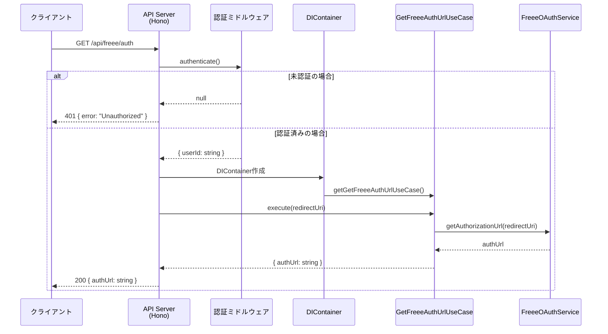

## Sequence Diagram

```mermaid
sequenceDiagram
    participant Client as クライアント
    participant API as API Server<br/>(Hono)
    participant Auth as 認証ミドルウェア
    participant Container as DIContainer
    participant UseCase as GetFreeeAuthUrlUseCase
    participant OAuthService as FreeeOAuthService

    Client->>API: GET /api/freee/auth
    API->>Auth: authenticate()
    alt 未認証の場合
        Auth-->>API: null
        API-->>Client: 401 { error: "Unauthorized" }
    else 認証済みの場合
        Auth-->>API: { userId: string }
        API->>Container: DIContainer作成
        Container->>UseCase: getGetFreeeAuthUrlUseCase()
        API->>UseCase: execute(redirectUri)
        UseCase->>OAuthService: getAuthorizationUrl(redirectUri)
        OAuthService-->>UseCase: authUrl
        UseCase-->>API: { authUrl: string }
        API-->>Client: 200 { authUrl: string }
    end
```
