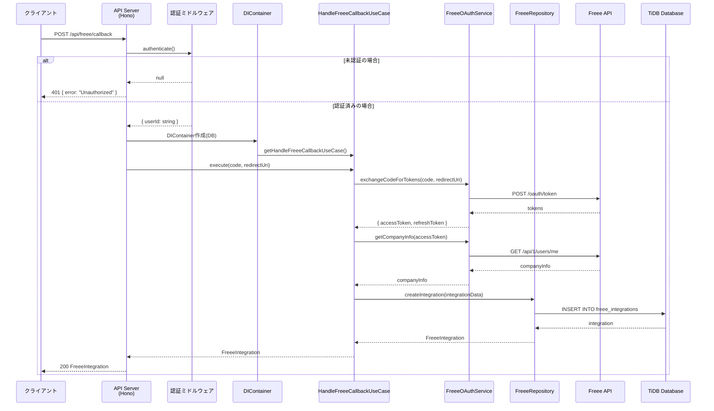

## Sequence Diagram

```mermaid
sequenceDiagram
    participant Client as クライアント
    participant API as API Server<br/>(Hono)
    participant Auth as 認証ミドルウェア
    participant Container as DIContainer
    participant UseCase as HandleFreeeCallbackUseCase
    participant OAuthService as FreeeOAuthService
    participant Repository as FreeeRepository
    participant Freee as Freee API
    participant DB as TiDB Database

    Client->>API: POST /api/freee/callback
    API->>Auth: authenticate()
    alt 未認証の場合
        Auth-->>API: null
        API-->>Client: 401 { error: "Unauthorized" }
    else 認証済みの場合
        Auth-->>API: { userId: string }
        API->>Container: DIContainer作成(DB)
        Container->>UseCase: getHandleFreeeCallbackUseCase()
        API->>UseCase: execute(code, redirectUri)
        UseCase->>OAuthService: exchangeCodeForTokens(code, redirectUri)
        OAuthService->>Freee: POST /oauth/token
        Freee-->>OAuthService: tokens
        OAuthService-->>UseCase: { accessToken, refreshToken }
        UseCase->>OAuthService: getCompanyInfo(accessToken)
        OAuthService->>Freee: GET /api/1/users/me
        Freee-->>OAuthService: companyInfo
        OAuthService-->>UseCase: companyInfo
        UseCase->>Repository: createIntegration(integrationData)
        Repository->>DB: INSERT INTO freee_integrations
        DB-->>Repository: integration
        Repository-->>UseCase: FreeeIntegration
        UseCase-->>API: FreeeIntegration
        API-->>Client: 200 FreeeIntegration
    end
```
