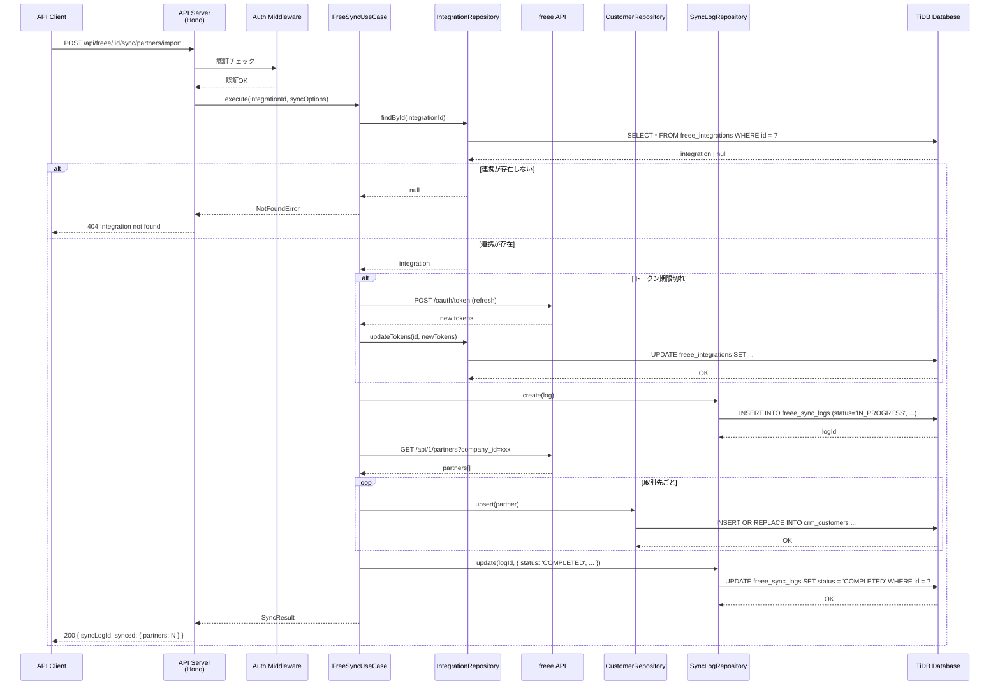

## Sequence Diagram

```mermaid
sequenceDiagram
    participant Client as API Client
    participant API as API Server<br/>(Hono)
    participant Auth as Auth Middleware
    participant UseCase as FreeSyncUseCase
    participant IntegrationRepo as IntegrationRepository
    participant FreeeAPI as freee API
    participant CustomerRepo as CustomerRepository
    participant SyncLogRepo as SyncLogRepository
    participant DB as TiDB Database

    Client->>API: POST /api/freee/:id/sync/partners/import
    API->>Auth: 認証チェック
    Auth-->>API: 認証OK

    API->>UseCase: execute(integrationId, syncOptions)
    UseCase->>IntegrationRepo: findById(integrationId)
    IntegrationRepo->>DB: SELECT * FROM freee_integrations WHERE id = ?
    DB-->>IntegrationRepo: integration | null

    alt 連携が存在しない
        IntegrationRepo-->>UseCase: null
        UseCase-->>API: NotFoundError
        API-->>Client: 404 Integration not found
    else 連携が存在
        IntegrationRepo-->>UseCase: integration

        alt トークン期限切れ
            UseCase->>FreeeAPI: POST /oauth/token (refresh)
            FreeeAPI-->>UseCase: new tokens
            UseCase->>IntegrationRepo: updateTokens(id, newTokens)
            IntegrationRepo->>DB: UPDATE freee_integrations SET ...
            DB-->>IntegrationRepo: OK
        end

        UseCase->>SyncLogRepo: create(log)
        SyncLogRepo->>DB: INSERT INTO freee_sync_logs (status='IN_PROGRESS', ...)
        DB-->>SyncLogRepo: logId

        UseCase->>FreeeAPI: GET /api/1/partners?company_id=xxx
        FreeeAPI-->>UseCase: partners[]

        loop 取引先ごと
            UseCase->>CustomerRepo: upsert(partner)
            CustomerRepo->>DB: INSERT OR REPLACE INTO crm_customers ...
            DB-->>CustomerRepo: OK
        end

        UseCase->>SyncLogRepo: update(logId, { status: 'COMPLETED', ... })
        SyncLogRepo->>DB: UPDATE freee_sync_logs SET status = 'COMPLETED' WHERE id = ?
        DB-->>SyncLogRepo: OK

        UseCase-->>API: SyncResult
        API-->>Client: 200 { syncLogId, synced: { partners: N } }
    end
```
