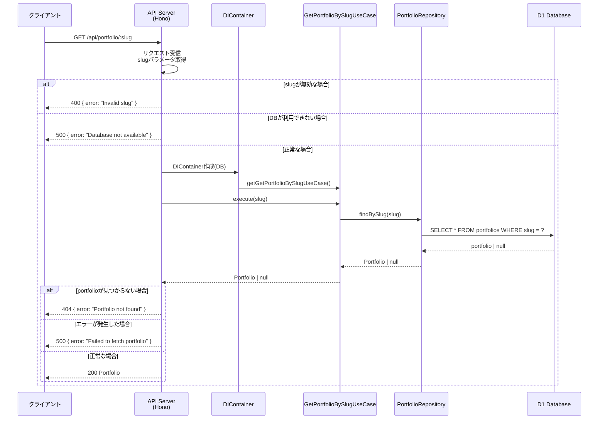

## Sequence Diagram

```mermaid
sequenceDiagram
    participant Client as クライアント
    participant API as API Server<br/>(Hono)
    participant Container as DIContainer
    participant UseCase as GetPortfolioBySlugUseCase
    participant Repository as PortfolioRepository
    participant DB as D1 Database

    Client->>API: GET /api/portfolio/:slug
    API->>API: リクエスト受信<br/>slugパラメータ取得
    alt slugが無効な場合
        API-->>Client: 400 { error: "Invalid slug" }
    else DBが利用できない場合
        API-->>Client: 500 { error: "Database not available" }
    else 正常な場合
        API->>Container: DIContainer作成(DB)
        Container->>UseCase: getGetPortfolioBySlugUseCase()
        API->>UseCase: execute(slug)
        UseCase->>Repository: findBySlug(slug)
        Repository->>DB: SELECT * FROM portfolios WHERE slug = ?
        DB-->>Repository: portfolio | null
        Repository-->>UseCase: Portfolio | null
        UseCase-->>API: Portfolio | null
        alt portfolioが見つからない場合
            API-->>Client: 404 { error: "Portfolio not found" }
        else エラーが発生した場合
            API-->>Client: 500 { error: "Failed to fetch portfolio" }
        else 正常な場合
            API-->>Client: 200 Portfolio
        end
    end
```
