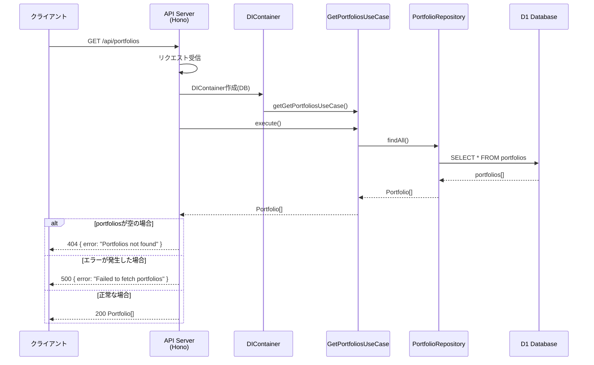

## Sequence Diagram

```mermaid
sequenceDiagram
    participant Client as クライアント
    participant API as API Server<br/>(Hono)
    participant Container as DIContainer
    participant UseCase as GetPortfoliosUseCase
    participant Repository as PortfolioRepository
    participant DB as D1 Database

    Client->>API: GET /api/portfolios
    API->>API: リクエスト受信
    API->>Container: DIContainer作成(DB)
    Container->>UseCase: getGetPortfoliosUseCase()
    API->>UseCase: execute()
    UseCase->>Repository: findAll()
    Repository->>DB: SELECT * FROM portfolios
    DB-->>Repository: portfolios[]
    Repository-->>UseCase: Portfolio[]
    UseCase-->>API: Portfolio[]
    alt portfoliosが空の場合
        API-->>Client: 404 { error: "Portfolios not found" }
    else エラーが発生した場合
        API-->>Client: 500 { error: "Failed to fetch portfolios" }
    else 正常な場合
        API-->>Client: 200 Portfolio[]
    end
```
