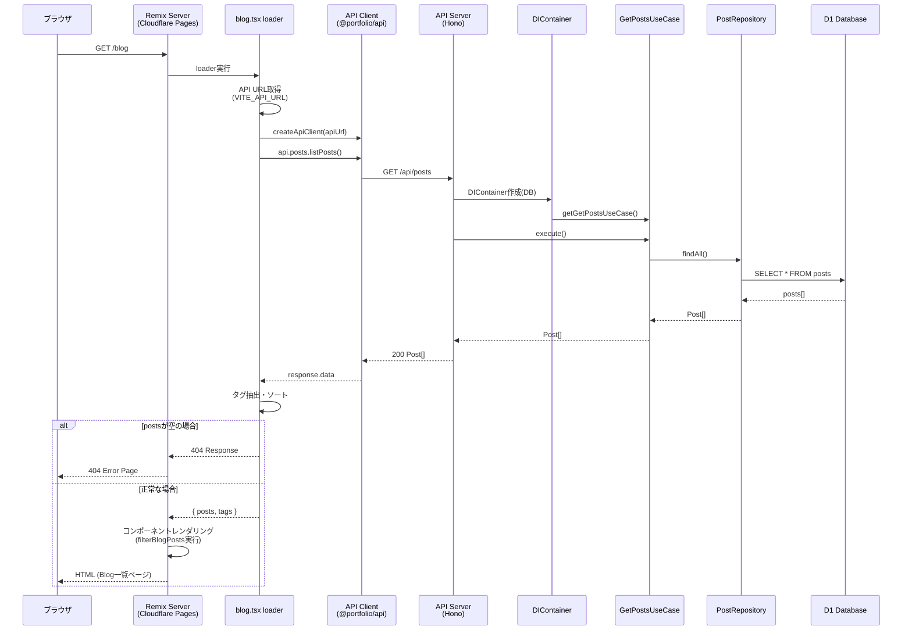

## Sequence Diagram

```mermaid
sequenceDiagram
    participant Browser as ブラウザ
    participant Remix as Remix Server<br/>(Cloudflare Pages)
    participant Loader as blog.tsx loader
    participant APIClient as API Client<br/>(@portfolio/api)
    participant API as API Server<br/>(Hono)
    participant Container as DIContainer
    participant UseCase as GetPostsUseCase
    participant Repository as PostRepository
    participant DB as D1 Database

    Browser->>Remix: GET /blog
    Remix->>Loader: loader実行
    Loader->>Loader: API URL取得<br/>(VITE_API_URL)
    Loader->>APIClient: createApiClient(apiUrl)
    Loader->>APIClient: api.posts.listPosts()
    APIClient->>API: GET /api/posts
    API->>Container: DIContainer作成(DB)
    Container->>UseCase: getGetPostsUseCase()
    API->>UseCase: execute()
    UseCase->>Repository: findAll()
    Repository->>DB: SELECT * FROM posts
    DB-->>Repository: posts[]
    Repository-->>UseCase: Post[]
    UseCase-->>API: Post[]
    API-->>APIClient: 200 Post[]
    APIClient-->>Loader: response.data
    Loader->>Loader: タグ抽出・ソート
    alt postsが空の場合
        Loader-->>Remix: 404 Response
        Remix-->>Browser: 404 Error Page
    else 正常な場合
        Loader-->>Remix: { posts, tags }
        Remix->>Remix: コンポーネントレンダリング<br/>(filterBlogPosts実行)
        Remix-->>Browser: HTML (Blog一覧ページ)
    end
```
