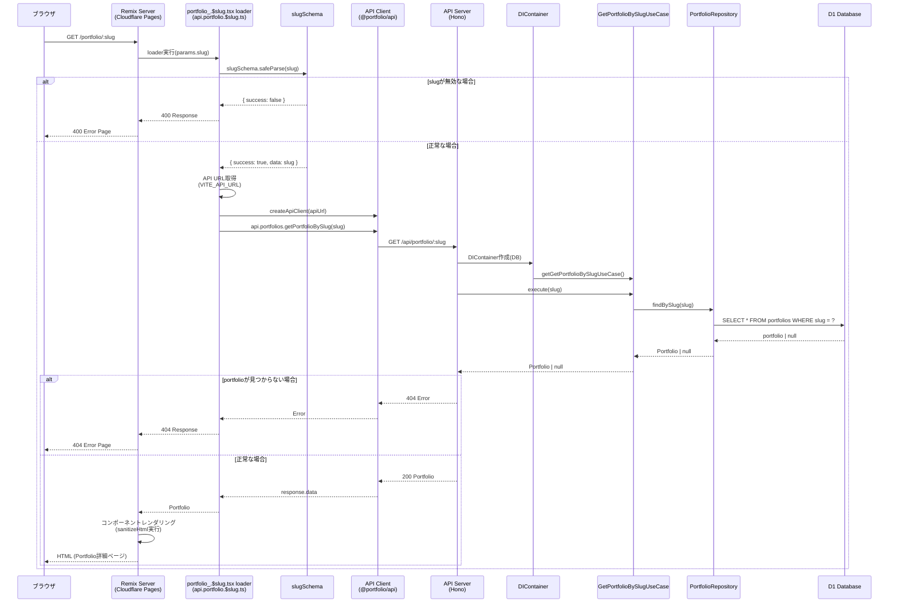

## Sequence Diagram

```mermaid
sequenceDiagram
    participant Browser as ブラウザ
    participant Remix as Remix Server<br/>(Cloudflare Pages)
    participant Loader as portfolio_.$slug.tsx loader<br/>(api.portfolio.$slug.ts)
    participant Validation as slugSchema
    participant APIClient as API Client<br/>(@portfolio/api)
    participant API as API Server<br/>(Hono)
    participant Container as DIContainer
    participant UseCase as GetPortfolioBySlugUseCase
    participant Repository as PortfolioRepository
    participant DB as D1 Database

    Browser->>Remix: GET /portfolio/:slug
    Remix->>Loader: loader実行(params.slug)
    Loader->>Validation: slugSchema.safeParse(slug)
    alt slugが無効な場合
        Validation-->>Loader: { success: false }
        Loader-->>Remix: 400 Response
        Remix-->>Browser: 400 Error Page
    else 正常な場合
        Validation-->>Loader: { success: true, data: slug }
        Loader->>Loader: API URL取得<br/>(VITE_API_URL)
        Loader->>APIClient: createApiClient(apiUrl)
        Loader->>APIClient: api.portfolios.getPortfolioBySlug(slug)
        APIClient->>API: GET /api/portfolio/:slug
        API->>Container: DIContainer作成(DB)
        Container->>UseCase: getGetPortfolioBySlugUseCase()
        API->>UseCase: execute(slug)
        UseCase->>Repository: findBySlug(slug)
        Repository->>DB: SELECT * FROM portfolios WHERE slug = ?
        DB-->>Repository: portfolio | null
        Repository-->>UseCase: Portfolio | null
        UseCase-->>API: Portfolio | null
        alt portfolioが見つからない場合
            API-->>APIClient: 404 Error
            APIClient-->>Loader: Error
            Loader-->>Remix: 404 Response
            Remix-->>Browser: 404 Error Page
        else 正常な場合
            API-->>APIClient: 200 Portfolio
            APIClient-->>Loader: response.data
            Loader-->>Remix: Portfolio
            Remix->>Remix: コンポーネントレンダリング<br/>(sanitizeHtml実行)
            Remix-->>Browser: HTML (Portfolio詳細ページ)
        end
    end
```
