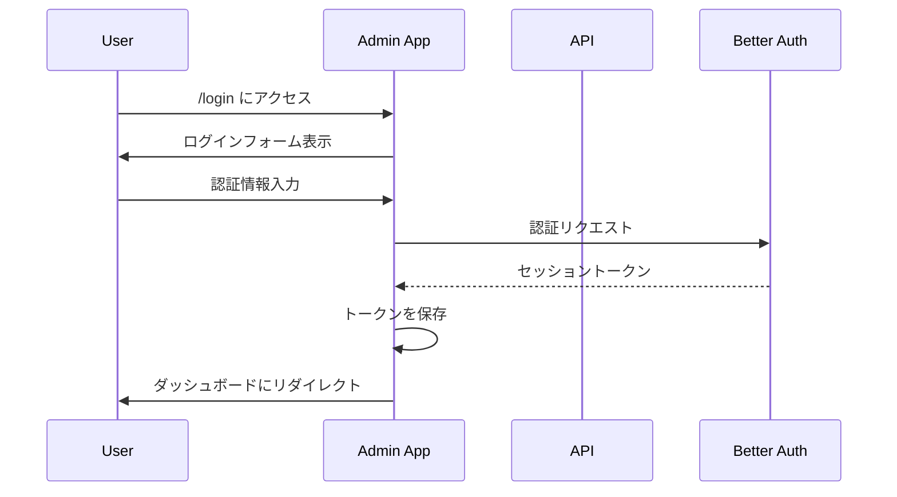

# Admin アプリケーション仕様

## 概要

管理ダッシュボード（`apps/admin`）の仕様を定義します。

## 技術スタック

| 項目 | 技術 |
| ---- | ---- |
| フレームワーク | TanStack Router + React |
| ビルドツール | Vite |
| ホスティング | Cloudflare Pages |
| スタイリング | Tailwind CSS |
| アーキテクチャ | Feature-Sliced Design (FSD) |

## ディレクトリ構造

```text
apps/admin/
├── app/
│   ├── routes/          # ページコンポーネント
│   ├── widgets/         # 大きなUIブロック
│   ├── features/        # ユーザー機能
│   ├── entities/        # ドメインモデル
│   └── shared/          # 共通リソース
├── public/              # 静的ファイル
└── e2e/                 # E2Eテスト
```

## ルーティング

### 認証

| パス | ページ | 認証 |
| ---- | ------ | ---- |
| `/login` | ログイン | 不要 |
| `/logout` | ログアウト | 必要 |

### ダッシュボード

| パス | ページ | 権限 |
| ---- | ------ | ---- |
| `/` | ダッシュボード | admin |
| `/posts` | 記事一覧 | admin |
| `/posts/new` | 記事作成 | admin |
| `/posts/:id` | 記事編集 | admin |
| `/portfolios` | ポートフォリオ一覧 | admin |
| `/portfolios/new` | ポートフォリオ作成 | admin |
| `/portfolios/:id` | ポートフォリオ編集 | admin |
| `/inquiries` | 問い合わせ一覧 | admin |
| `/inquiries/:id` | 問い合わせ詳細 | admin |

### CRM

| パス | ページ | 権限 |
| ---- | ------ | ---- |
| `/crm/customers` | 顧客一覧 | crm-user |
| `/crm/customers/:id` | 顧客詳細 | crm-user |
| `/crm/leads` | リード一覧 | crm-user |
| `/crm/leads/:id` | リード詳細 | crm-user |
| `/crm/deals` | 案件パイプライン | crm-user |
| `/crm/deals/:id` | 案件詳細 | crm-user |
| `/crm/pipelines` | パイプライン設定 | admin |

## レイアウト

### 認証済みレイアウト

```text
┌─────────────────────────────────────────────┐
│ Header                           [User] [▼] │
├──────────┬──────────────────────────────────┤
│          │                                   │
│ Sidebar  │  Main Content                     │
│          │                                   │
│ - ダッシュ│                                   │
│ - 記事    │                                   │
│ - ポート  │                                   │
│ - 問合せ  │                                   │
│ - CRM ▼  │                                   │
│   - 顧客  │                                   │
│   - リード│                                   │
│   - 案件  │                                   │
│          │                                   │
└──────────┴───────────────────────────────────┘
```

## ページ仕様

### ダッシュボード (`/`)

#### 概要

管理画面のメインダッシュボード。統計情報と最近のアクティビティを表示。

#### ウィジェット

| ウィジェット | 説明 |
| ------------ | ---- |
| 統計カード | 記事数、ポートフォリオ数、問い合わせ数 |
| 最近の問い合わせ | 新着問い合わせリスト |
| アクティビティ | 最近の更新履歴 |

### 記事管理 (`/posts`)

- 記事一覧表示（ページネーション）
- 記事の検索
- 記事の作成/編集/削除
- 下書き/公開の切り替え
- タグ管理

#### テーブル列

| 列 | 説明 |
| -- | ---- |
| タイトル | 記事タイトル |
| ステータス | 公開/下書き |
| 作成日 | 作成日時 |
| 更新日 | 更新日時 |
| 操作 | 編集/削除ボタン |

### ポートフォリオ管理 (`/portfolios`)

- ポートフォリオ一覧表示
- ポートフォリオの作成/編集/削除
- 画像のアップロード/管理
- 表示順の並び替え

#### カード表示

| 項目 | 説明 |
| ---- | ---- |
| サムネイル | メイン画像のサムネイル |
| タイトル | プロジェクト名 |
| 会社名 | クライアント名 |
| 期間 | 開始日 - 終了日（または現在） |

### 問い合わせ管理 (`/inquiries`)

- 問い合わせ一覧表示
- 未読/既読の管理
- ステータス管理（新規/対応中/完了/保留）
- 返信機能

#### ステータスフロー

```text
新規 → 対応中 → 完了
         ↓
       保留
```

### CRM - 顧客管理 (`/crm/customers`)

- 顧客一覧表示
- 顧客の検索/フィルタリング
- 顧客の作成/編集/削除
- 顧客履歴の表示

### CRM - リード管理 (`/crm/leads`)

- リード一覧表示
- リードのステータス管理
- リードから顧客への変換
- リードの作成/編集/削除

### CRM - 案件管理 (`/crm/deals`)

- カンバン形式のパイプライン表示
- ドラッグ&ドロップでステージ移動
- 案件の作成/編集/削除
- 成約/失注のマーク

## 認証・認可

### 認証フロー



### 権限マトリクス

| 機能 | admin | crm-user | viewer |
| ---- | ----- | -------- | ------ |
| 記事管理 | CRUD | - | R |
| ポートフォリオ管理 | CRUD | - | R |
| 問い合わせ管理 | CRUD | - | R |
| CRM | CRUD | CRUD | R |
| 設定 | CRUD | - | - |

## APIエンドポイント

管理画面から呼び出すAPIエンドポイント一覧。

| 機能 | メソッド | エンドポイント |
| ---- | -------- | -------------- |
| 記事一覧 | GET | `/api/posts` |
| 記事作成 | POST | `/api/posts` |
| 記事更新 | PUT | `/api/posts/:id` |
| 記事削除 | DELETE | `/api/posts/:id` |
| ポートフォリオ一覧 | GET | `/api/portfolios` |
| 画像アップロード | POST | `/api/portfolios/:id/images` |
| 問い合わせ一覧 | GET | `/api/inquiries` |
| 問い合わせ返信 | POST | `/api/inquiries/:id/responses` |
| 顧客一覧 | GET | `/api/crm/customers` |
| リード一覧 | GET | `/api/crm/leads` |
| リード変換 | POST | `/api/crm/leads/:id/convert` |
| 案件一覧 | GET | `/api/crm/deals` |
| 案件ステージ移動 | PATCH | `/api/crm/deals/:id/stage` |

## 状態管理

### グローバル状態

| 状態 | 説明 | 管理方法 |
| ---- | ---- | -------- |
| 認証状態 | ユーザー情報、セッション | Context |
| テーマ | ライト/ダーク | localStorage |
| サイドバー | 開閉状態 | localStorage |

### サーバー状態

TanStack Query を使用してサーバー状態を管理。

```typescript
// キャッシュキー例
const queryKeys = {
    posts: ["posts"] as const,
    post: (id: string) => ["posts", id] as const,
    portfolios: ["portfolios"] as const,
    inquiries: ["inquiries"] as const,
    customers: ["crm", "customers"] as const,
    leads: ["crm", "leads"] as const,
    deals: ["crm", "deals"] as const,
};
```

## UI/UXガイドライン

### カラーパレット

| 用途 | ライト | ダーク |
| ---- | ------ | ------ |
| 背景 | #FFFFFF | #1F2937 |
| テキスト | #1F2937 | #F9FAFB |
| プライマリ | #3B82F6 | #60A5FA |
| 成功 | #10B981 | #34D399 |
| 警告 | #F59E0B | #FBBF24 |
| エラー | #EF4444 | #F87171 |

### レスポンシブ

| ブレークポイント | サイドバー | レイアウト |
| ---------------- | ---------- | ---------- |
| < 768px | 非表示（ハンバーガー） | シングルカラム |
| >= 768px | 表示（折りたたみ可） | サイドバー + メイン |
| >= 1280px | 表示（展開） | サイドバー + メイン |

## 関連ドキュメント

- [アーキテクチャ概要](../../architecture/overview.md)
- [FSD設計](../../architecture/feature-sliced.md)
- [API仕様](../api/)
- [ユーザーストーリー](../../user-stories/admin/)
