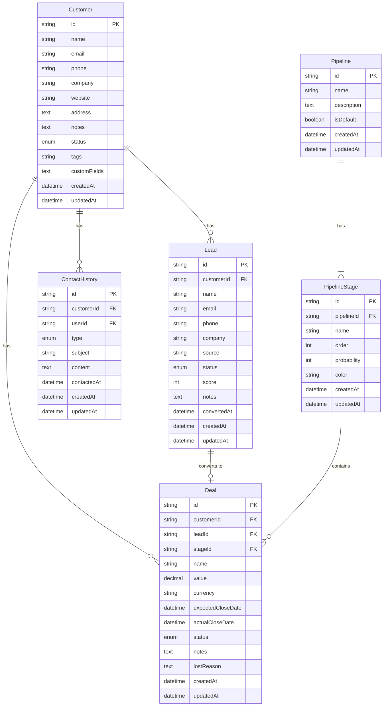

CRMシステムのデータベース設計仕様書です。

## ER図

---

## テーブル定義

### customers（顧客）

| カラム | 型 | NULL | デフォルト | 説明 |
|--------|-----|------|-----------|------|
| id | VARCHAR(36) | NO | uuid() | 主キー |
| name | VARCHAR(255) | NO | - | 顧客名 |
| email | VARCHAR(255) | YES | NULL | メールアドレス |
| phone | VARCHAR(50) | YES | NULL | 電話番号 |
| company | VARCHAR(255) | YES | NULL | 会社名 |
| website | VARCHAR(255) | YES | NULL | ウェブサイト |
| address | TEXT | YES | NULL | 住所 |
| notes | TEXT | YES | NULL | メモ |
| status | ENUM | NO | 'PROSPECT' | ステータス |
| tags | VARCHAR(255) | YES | NULL | タグ（JSON配列） |
| custom_fields | TEXT | YES | NULL | カスタムフィールド（JSON） |
| created_at | DATETIME | NO | NOW() | 作成日時 |
| updated_at | DATETIME | NO | NOW() | 更新日時 |

**ステータス値:**
- `ACTIVE`: アクティブ
- `INACTIVE`: 非アクティブ
- `PROSPECT`: 見込み客
- `CHURNED`: 解約済み

**インデックス:**
- `idx_customers_email` (email)
- `idx_customers_status` (status)

---

### leads（リード）

| カラム | 型 | NULL | デフォルト | 説明 |
|--------|-----|------|-----------|------|
| id | VARCHAR(36) | NO | uuid() | 主キー |
| customer_id | VARCHAR(36) | YES | NULL | 顧客ID（FK） |
| name | VARCHAR(255) | NO | - | リード名 |
| email | VARCHAR(255) | YES | NULL | メールアドレス |
| phone | VARCHAR(50) | YES | NULL | 電話番号 |
| company | VARCHAR(255) | YES | NULL | 会社名 |
| source | VARCHAR(100) | YES | NULL | 流入元 |
| status | ENUM | NO | 'NEW' | ステータス |
| score | INT | YES | NULL | リードスコア |
| notes | TEXT | YES | NULL | メモ |
| converted_at | DATETIME | YES | NULL | 変換日時 |
| created_at | DATETIME | NO | NOW() | 作成日時 |
| updated_at | DATETIME | NO | NOW() | 更新日時 |

**ステータス値:**
- `NEW`: 新規
- `CONTACTED`: コンタクト済み
- `QUALIFIED`: 適格
- `UNQUALIFIED`: 不適格
- `CONVERTED`: 変換済み

**外部キー:**
- `customer_id` → `customers(id)` ON DELETE SET NULL

**インデックス:**
- `idx_leads_email` (email)
- `idx_leads_status` (status)

---

### deals（商談）

| カラム | 型 | NULL | デフォルト | 説明 |
|--------|-----|------|-----------|------|
| id | VARCHAR(36) | NO | uuid() | 主キー |
| customer_id | VARCHAR(36) | YES | NULL | 顧客ID（FK） |
| lead_id | VARCHAR(36) | YES | NULL | リードID（FK、UNIQUE） |
| stage_id | VARCHAR(36) | NO | - | ステージID（FK） |
| name | VARCHAR(255) | NO | - | 商談名 |
| value | DECIMAL(15,2) | YES | NULL | 商談金額 |
| currency | VARCHAR(3) | NO | 'JPY' | 通貨 |
| expected_close_date | DATETIME | YES | NULL | 予定クローズ日 |
| actual_close_date | DATETIME | YES | NULL | 実際のクローズ日 |
| status | ENUM | NO | 'OPEN' | ステータス |
| notes | TEXT | YES | NULL | メモ |
| lost_reason | TEXT | YES | NULL | 失注理由 |
| created_at | DATETIME | NO | NOW() | 作成日時 |
| updated_at | DATETIME | NO | NOW() | 更新日時 |

**ステータス値:**
- `OPEN`: 進行中
- `WON`: 受注
- `LOST`: 失注
- `STALLED`: 停滞

**外部キー:**
- `customer_id` → `customers(id)` ON DELETE SET NULL
- `lead_id` → `leads(id)` ON DELETE SET NULL (UNIQUE制約)
- `stage_id` → `pipeline_stages(id)`

**インデックス:**
- `idx_deals_customer_id` (customer_id)
- `idx_deals_stage_id` (stage_id)
- `idx_deals_status` (status)

---

### pipelines（パイプライン）

| カラム | 型 | NULL | デフォルト | 説明 |
|--------|-----|------|-----------|------|
| id | VARCHAR(36) | NO | uuid() | 主キー |
| name | VARCHAR(255) | NO | - | パイプライン名 |
| description | TEXT | YES | NULL | 説明 |
| is_default | BOOLEAN | NO | FALSE | デフォルトフラグ |
| created_at | DATETIME | NO | NOW() | 作成日時 |
| updated_at | DATETIME | NO | NOW() | 更新日時 |

---

### pipeline_stages（パイプラインステージ）

| カラム | 型 | NULL | デフォルト | 説明 |
|--------|-----|------|-----------|------|
| id | VARCHAR(36) | NO | uuid() | 主キー |
| pipeline_id | VARCHAR(36) | NO | - | パイプラインID（FK） |
| name | VARCHAR(255) | NO | - | ステージ名 |
| order | INT | NO | - | 表示順序 |
| probability | INT | YES | NULL | 成約確率（0-100） |
| color | VARCHAR(7) | YES | NULL | カラーコード |
| created_at | DATETIME | NO | NOW() | 作成日時 |
| updated_at | DATETIME | NO | NOW() | 更新日時 |

**外部キー:**
- `pipeline_id` → `pipelines(id)` ON DELETE CASCADE

**インデックス:**
- `idx_pipeline_stages_order` (pipeline_id, order)

---

### contact_histories（コンタクト履歴）

| カラム | 型 | NULL | デフォルト | 説明 |
|--------|-----|------|-----------|------|
| id | VARCHAR(36) | NO | uuid() | 主キー |
| customer_id | VARCHAR(36) | NO | - | 顧客ID（FK） |
| user_id | VARCHAR(36) | YES | NULL | 担当者ID（FK） |
| type | ENUM | NO | - | コンタクト種別 |
| subject | VARCHAR(255) | YES | NULL | 件名 |
| content | TEXT | YES | NULL | 内容 |
| contacted_at | DATETIME | NO | NOW() | コンタクト日時 |
| created_at | DATETIME | NO | NOW() | 作成日時 |
| updated_at | DATETIME | NO | NOW() | 更新日時 |

**コンタクト種別:**
- `EMAIL`: メール
- `PHONE`: 電話
- `MEETING`: ミーティング
- `CHAT`: チャット
- `NOTE`: メモ
- `OTHER`: その他

**外部キー:**
- `customer_id` → `customers(id)` ON DELETE CASCADE
- `user_id` → `users(id)` ON DELETE SET NULL

**インデックス:**
- `idx_contact_histories_customer_id` (customer_id)
- `idx_contact_histories_contacted_at` (contacted_at)

---

## Prismaスキーマ参照

詳細な定義は以下を参照:
- `packages/db/prisma/schema/crm.prisma`
